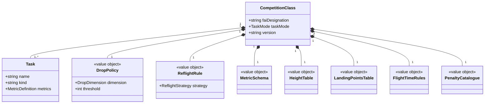
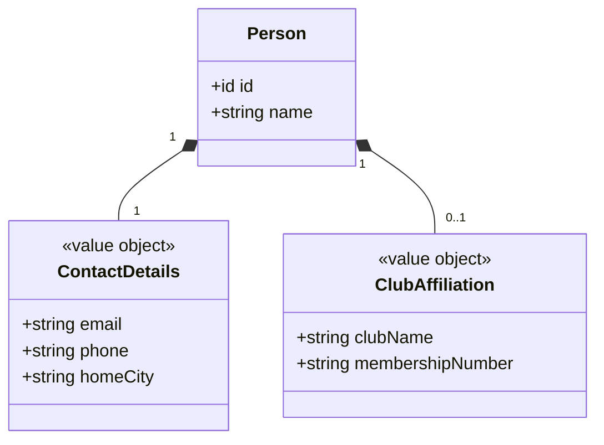
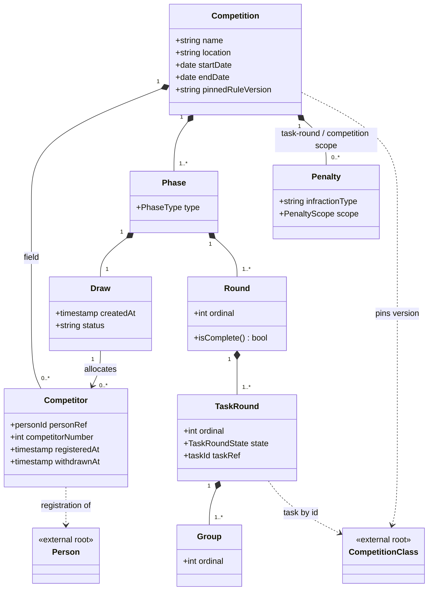
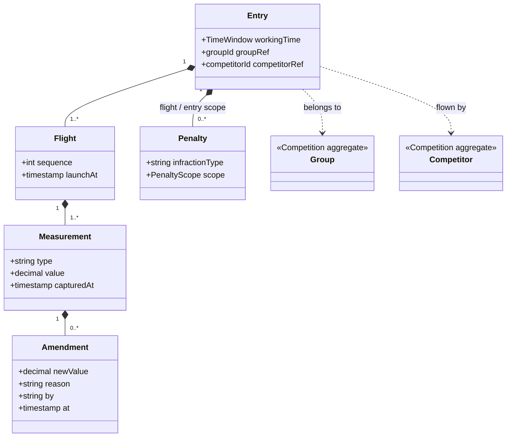
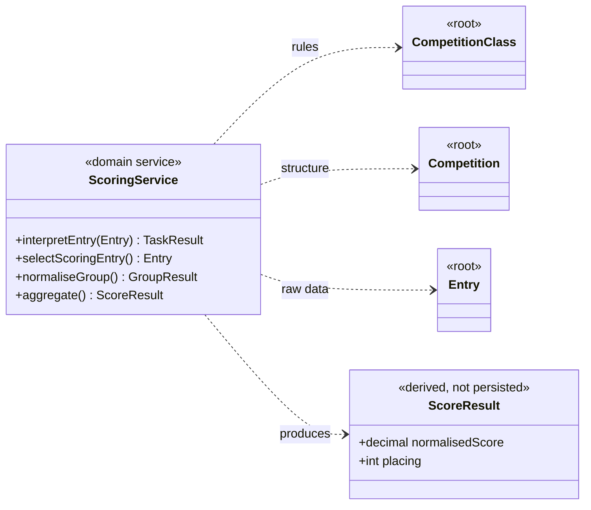

# RC Soaring — Aggregate Boundaries

One diagram per aggregate root. Each shows the root (**yellow**), the entities
and value objects that live *inside* its consistency boundary (filled diamonds),
and everything it reaches across the boundary **by id** (grey, dashed arrows) —
other roots, or entities that live inside another aggregate. Nothing inside one
aggregate holds a direct object reference into another — across a boundary you
reference by id only.

## A note on how many roots there are

You marked three roots: **CompetitionClass**, **Competition**, **Competitor**
(the last has since been reworked: the system-wide root is now **Person**, and
*Competitor* names a person's registration inside a Competition — see §2–§3 and
`soaring-registration.md`).
Drawing them per-aggregate exposes a problem the whole-model diagram hides: the
composition spine is ten deep, and if all of it lives inside **Competition**,
then the entire event — every flight, every raw measurement — is one aggregate.
Its lower half (**Entry → Flight → Measurement → Amendment**) is written *live*
by the scorers, at high concurrency. Keeping that inside
Competition means every score update must load and lock the whole event.

So the model pushes toward a **fourth root: Entry** — the unit of live capture.
Split out and referenced from Group by id, each pilot's working-time record
becomes independent, which is what a real-time capture system needs. This is the
standard "small aggregates, reference across boundaries by id" pattern. The
diagrams below assume this split. If you'd rather keep one large Competition
aggregate for simplicity, fold Entry back in and accept the write-contention
cost — but for live hardware capture I'd keep them separate.

The penalty scope enum maps cleanly onto the boundary: **Flight** and **Entry**
scoped penalties live in the Entry aggregate; **TaskRound** and **Competition**
scoped penalties live in the Competition aggregate.

---

## 1. CompetitionClass — the rulebook

Pure reference data. It defines the tasks and every rule used to turn raw numbers
into scores, and it references nothing else. Versioned, and pinned by a
Competition at creation so historical results stay reproducible.

---

## 2. Person — a registered person

Anyone known to the system: identity, contact details, and club affiliation.
Registering with the system happens once, and is what lets an organiser build a
competition's field from known people. Deliberately free of contest data: it is
referenced by id from each Competition's Competitor records and owns nothing
downstream of that. Email is unique system-wide (enforced at the repository /
unique-index level — the standard cross-aggregate uniqueness answer).

---

## 3. Competition — the event structure, field and schedule

The setup and shape of one event: its phases, rounds, task-rounds, groups, the
draw — and now the field itself. Each **Competitor** is one person's
registration into this event (competitor number, registered/withdrawn
timestamps), referencing the system-wide Person by id. Registrations live
inside this aggregate because the draw's fairness invariant needs the field as
one consistent set, and registration writes are low-volume — the contention
argument that pushes Entry out does not apply here. Created up front and only
lightly mutated afterwards (register or withdraw a competitor, append a
reflight group, annul a task-round). It holds no live flight data — Entries reference their Group and
Competitor by id from outside. Task-round completion and annulment live here;
scoring reads this structure but writes nothing back to it.

> **Group membership** is not stored here — it is the set of Entries whose
> `groupRef` points at a given Group. "Who is in Group C" is a query over the
> Entry aggregate, not a list held on Group. Field membership *is* stored here —
> the Competitor records. Two different things: the field is who is in the
> competition; group membership is who flew where.

> **Field freeze:** competitors are added or removed only until the draw is
> accepted. After that a withdrawal is recorded but leaves the draw intact —
> the competitor's entries simply never occur — and changing the field means
> redrawing.

---

## 4. Entry — the live flying record

One competitor's working-time window and everything captured in it. This is what
the scorers directly update: an ordered list of Flights, each with raw
Measurements (append-only, corrected by Amendments, never overwritten). A
reflight is simply a second Entry pointing at whichever Group flew it. Isolating
this as its own aggregate is what keeps concurrent scorer writes from contending.
`competitorRef` identifies the Competitor registration inside the Competition
aggregate — the record that carries the competitor number the scorers name/id
captures with, and the link back to the Person. Referencing an internal entity
of another aggregate by id is fine here (precedent: `groupRef`) because Entry
only ever holds the id — any mutation of a Competitor still goes through the
Competition root.

---

## Scoring is cross-aggregate (not a root)

The scoring service is a domain service, not an aggregate. It *reads* rules from
CompetitionClass, structure from Competition, and raw data from the Entries, and
*produces* a ScoreResult that is derived on demand and never persisted as source
of truth. It has no consistency boundary of its own — it spans all of them.

