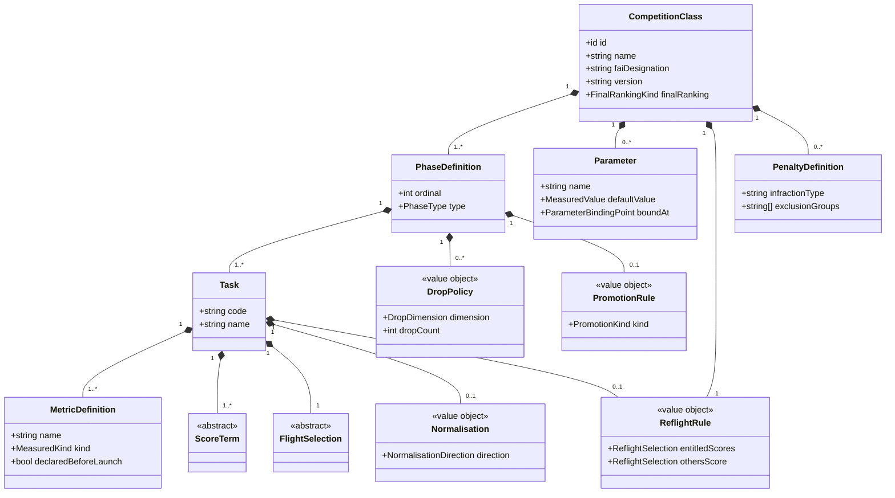
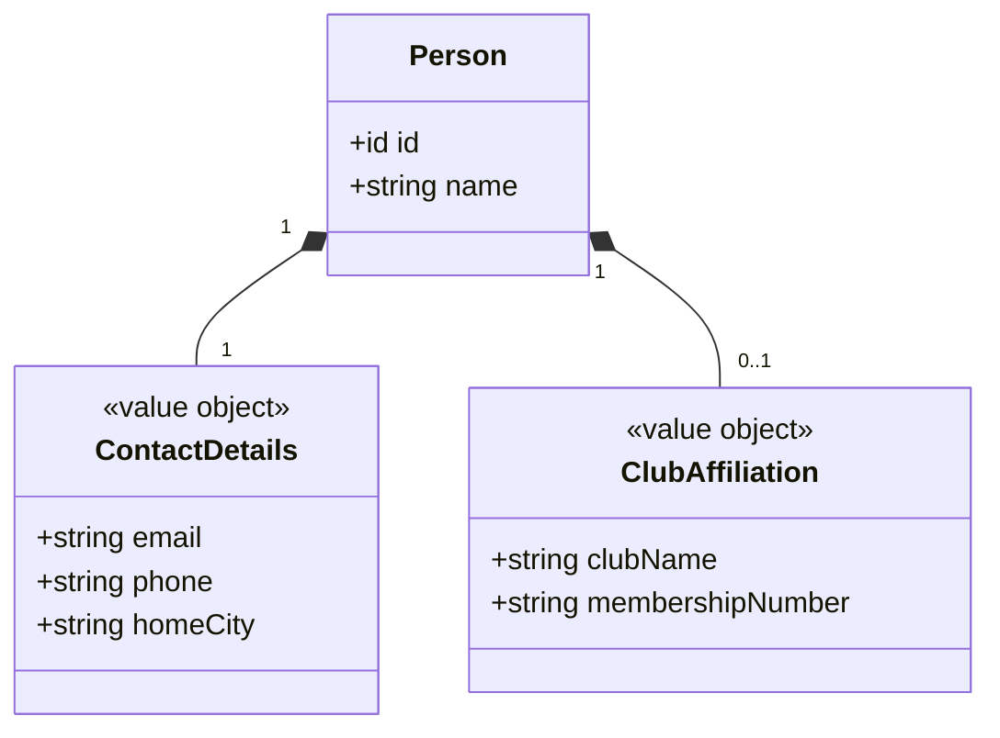
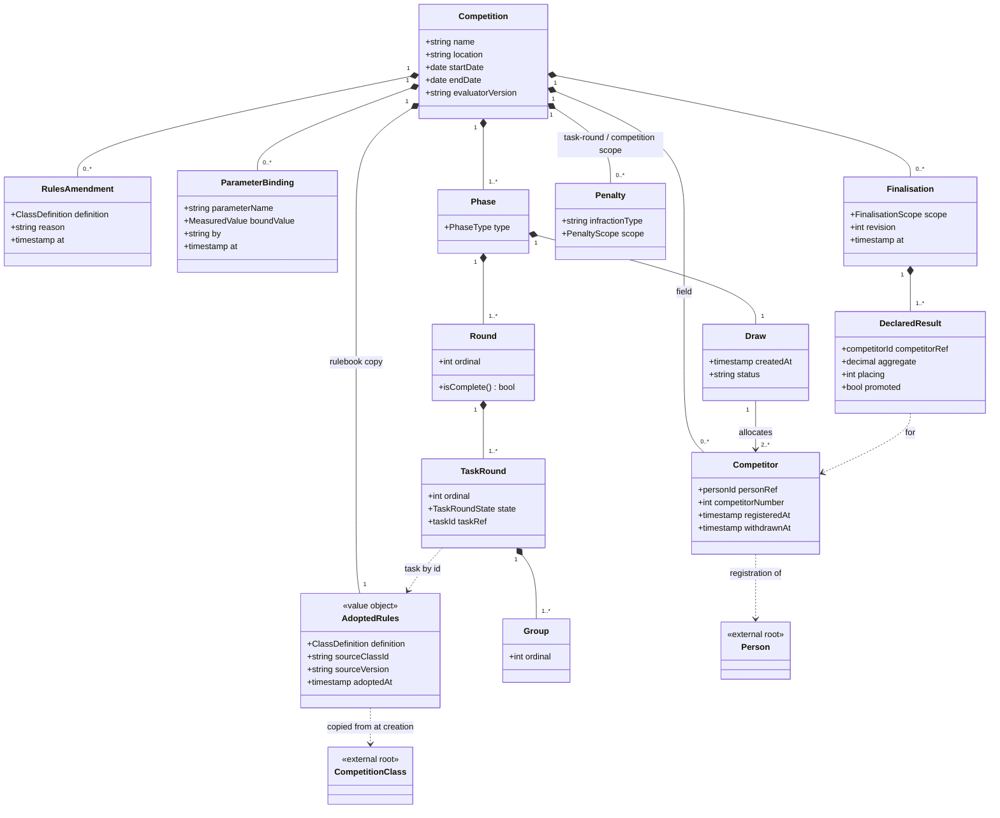
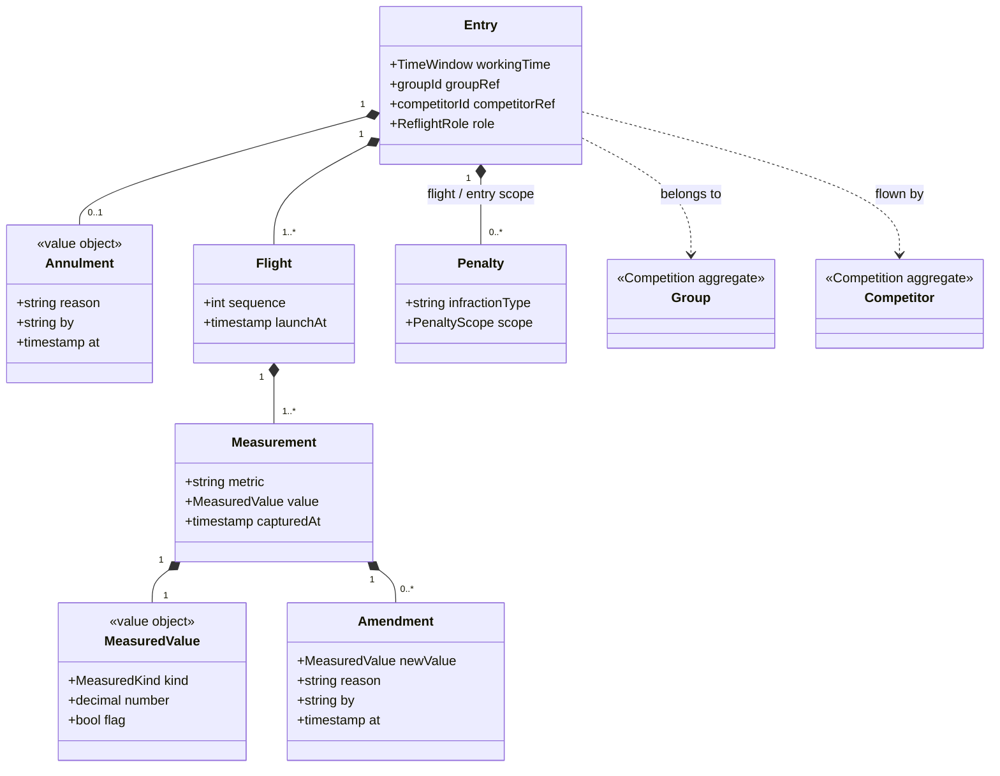
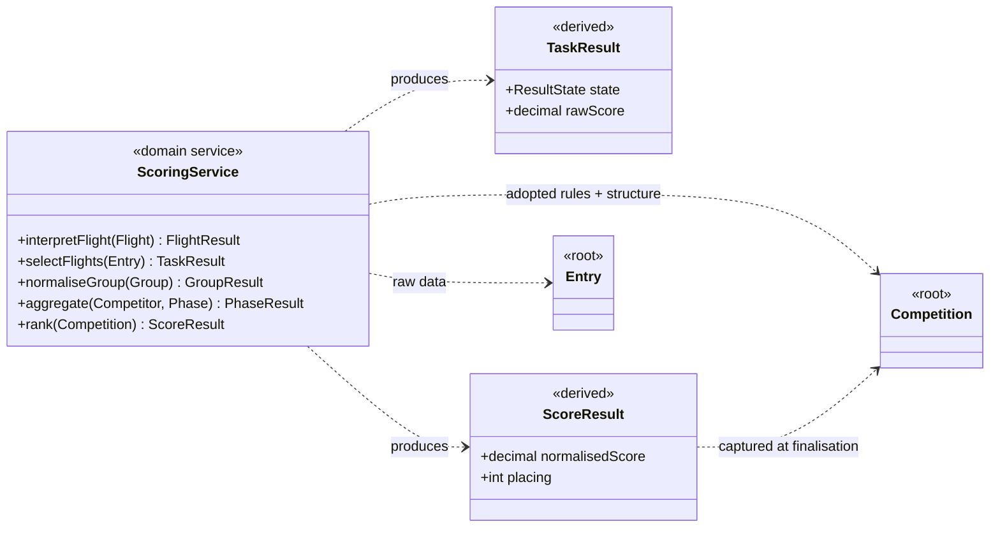

# RC Soaring — Aggregate Boundaries

One diagram per aggregate root. Each shows the root (**yellow**), the entities
and value objects that live *inside* its consistency boundary (filled diamonds),
and everything it reaches across the boundary **by id** (grey, dashed arrows) —
other roots, or entities that live inside another aggregate. Nothing inside one
aggregate holds a direct object reference into another — across a boundary you
reference by id only.

## Why there are four roots, not three

The obvious split is three roots: **CompetitionClass**, **Competition**, and a
per-person root — now **Person**, with **Competitor** naming a person's
registration inside a Competition. Drawing them per-aggregate exposes a problem
the whole-model diagram hides: the composition spine is ten deep, and if all of
it lives inside **Competition**, then the entire event — every flight, every raw
measurement — is one aggregate. Its lower half (**Entry → Flight → Measurement →
Amendment**) is written *live* by the scorers, at high concurrency. Keeping that
inside Competition means every score update must load and lock the whole event.

So the model pushes toward a **fourth root: Entry** — the unit of live capture.
Split out and referenced from Group by id, each pilot's working-time record
becomes independent, which is what a real-time capture system needs. This is the
standard "small aggregates, reference across boundaries by id" pattern, and the
diagrams below assume this split. Folding Entry back into one large Competition
aggregate would trade it for write contention on every score update — the wrong
trade for live hardware capture.

The penalty scope enum maps cleanly onto the boundary: **Flight** and **Entry**
scoped penalties live in the Entry aggregate; **TaskRound** and **Competition**
scoped penalties live in the Competition aggregate.

---

## 1. CompetitionClass — the rulebook library

Pure reference data, and referencing nothing else. An ordered list of phase
definitions, each owning the tasks flown in it and how their results aggregate;
the class itself holds only what is true of the whole event. Every task carries
its own metrics, flight selection, timing, group constraints and scoring terms,
because all of those vary per task within a single class — and several of those
slots are optional, because a rulebook that states no rule is recorded as
stating none: a phase need not discard, a task need not normalise and need not
group-score.

**The diagram below abbreviates; it does not disagree.** Only the attributes
that identify each class are shown, and the value objects that add nothing to
the *boundary* picture — `RoundComposition`, `ValidityRule`, `TaskTiming`,
`GroupConstraint`, `Rounding`, `Band`, `LookupRow`, `Predicate`,
`PenaltyEffectSpec` — are left out for legibility. `ScoreTerm` and
`FlightSelection` are drawn as the abstract types they are, and their subtypes
are left out on the same grounds: the boundary picture needs to know a Task owns
its terms, not which five shapes a term comes in. That is also why the
`then`/`else` recursion is not drawn here — it belongs to `ConditionalTerm`, one
of those subtypes. What *is* drawn must match
[soaring-domain-class-diagram.md](soaring-domain-class-diagram.md) §2–§3
exactly, multiplicity for multiplicity; that document is the authority whenever
the two differ.

**This aggregate is not on the scoring path.** A Competition takes a complete
copy of a class definition when it is created (§3), and scoring reads that copy.
CompetitionClass is the library you adopt *from* — seed data for the FAI classes,
plus any a club authors — so editing or retiring one here cannot disturb a
running or finished event.

**In code, this one concept is two types**, added when the event-sourcing
model was built: `ClassDefinition` is the rulebook itself — the pure value object this diagram draws, with no
identity of its own — and `PublishedClassDefinition` is the actual aggregate
root: it wraps a `ClassDefinition` with the content-hash identity (ADR-0002
§5), publish/retire timestamps, and the events/fold logic Marten streams
against. The diagram's `+id id` is `PublishedClassDefinition`'s content hash,
not a field `ClassDefinition` carries. This is a code-level split of one
domain concept, not two — nothing here changes the glossary.

Full structure and the scoring vocabulary are in
[soaring-domain-class-diagram.md](soaring-domain-class-diagram.md) §2–§3.

---

## 2. Person — a registered person

Anyone known to the system: identity, contact details, and club affiliation.
Registering with the system happens once, and is what lets an organiser build a
competition's field from known people. Deliberately free of contest data: it is
referenced by id from each Competition's Competitor records and owns nothing
downstream of that. Email is unique system-wide (enforced at the repository /
unique-index level — the standard cross-aggregate uniqueness answer).

---

## 3. Competition — the event structure, field and schedule

The setup and shape of one event: its phases, rounds, task-rounds, groups, the
draw — and now the field itself. Each **Competitor** is one person's
registration into this event (competitor number, registered/withdrawn
timestamps), referencing the system-wide Person by id. Registrations live
inside this aggregate because the draw's fairness invariant needs the field as
one consistent set, and registration writes are low-volume — the contention
argument that pushes Entry out does not apply here. Created up front and only
lightly mutated afterwards (register or withdraw a competitor, append a
reflight group, annul a task-round). It holds no live flight data — Entries reference their Group and
Competitor by id from outside. Task-round completion and annulment live here;
scoring reads this structure but writes nothing back to it.

It also holds three things that make results reproducible:

- **`AdoptedRules`** — a complete copy of the class definition, taken at
  creation, with the source class and version it came from and the evaluator
  version that interprets it. This is what scoring reads. A `RulesAmendment`
  appends a corrected definition and applies to the whole competition
  retroactively; because results are derived, that costs nothing but a
  re-query. Adoption is also the gate at which a definition is validated — a
  Competition cannot come into existence holding an invalid rulebook.
- **`ParameterBinding`** — one per choice the class left open, recorded when it
  is made and by whom. Some arrive at setup, some the day before flying from
  measured conditions, some per round, some mid-round. They are events rather
  than configuration precisely because re-scoring must reproduce the decisions
  as they were actually taken.
- **`Finalisation`** — the declared results. Finalising a phase freezes its
  results and names who was promoted, which is where a flyoff cut decision is
  recorded; finalising the competition captures the final classification.
  Reopening after an error appends a further revision and keeps the earlier one.

> **Group membership** is not stored here — it is the set of Entries whose
> `groupRef` points at a given Group. "Who is in Group C" is a query over the
> Entry aggregate, not a list held on Group. Field membership *is* stored here —
> the Competitor records. Two different things: the field is who is in the
> competition; group membership is who flew where.

> **Field freeze:** competitors are added or removed only until the draw is
> accepted. After that a withdrawal is recorded but leaves the draw intact —
> the competitor's entries simply never occur — and changing the field means
> redrawing.

---

## 4. Entry — the live flying record

One competitor's working-time window and everything captured in it. This is what
the scorers directly update: an ordered list of Flights, each with raw
Measurements (append-only, corrected by Amendments, never overwritten). A
Measurement's value may be a number or a plain flag — the rules require
observations such as *landed in the defined area* or *score card signed*
alongside quantities. Isolating this as its own aggregate is what keeps
concurrent scorer writes from contending.

A reflight is simply a second Entry pointing at whichever Group flew it, and
`role` is what decides which Entry counts: within a single reflight group the
**entitled** competitor's new attempt is official even if worse, while every
other pilot flying it — the **fillers** drawn in to make up the group — takes
the better of their two. One event, two rules, discriminated by role.

An Entry may also carry an **`Annulment`** — a ruling that this attempt does not
count, with the reason, who ruled and when. `F3F.1.5`'s provisional re-flight is
why it exists: the competitor re-flies under protest and the jury afterwards
decides which of the two attempts stands, which `ReflightSelection` cannot
express because it states one rule for the whole class. Annulling is a write to
the Entry root, appended like everything else here, and scoring reads it by
skipping the Entry at `select flights`.
`competitorRef` identifies the Competitor registration inside the Competition
aggregate — the record that carries the competitor number the scorers name/id
captures with, and the link back to the Person. Referencing an internal entity
of another aggregate by id is fine here (precedent: `groupRef`) because Entry
only ever holds the id — any mutation of a Competitor still goes through the
Competition root.

---

## Scoring is cross-aggregate (not a root)

The scoring service is a domain service, not an aggregate. It *reads* the rules
and the structure from the **Competition** — the rulebook is the Competition's
own copy, not the library class — and raw data from the Entries, and *produces*
a ScoreResult derived on demand. It has no consistency boundary of its own.

**It spans two roots, not three.** Because the Competition carries its own
rulebook, `CompetitionClass` is absent from the scoring path entirely. That is
the point of the copy: the library can be edited, versioned or retired without
any live or historical event noticing.

Results stay derived throughout the event. At finalisation they are additionally
*captured* on the Competition as a declared record — which answers "what was
declared", never "what is the score". Raw measurements plus the adopted rules
remain the sole source of truth, so a declared result can always be re-derived
and compared against what was published. That comparison is the reason to
capture them at all: it is what makes a later change in the evaluator visible
instead of silent.

