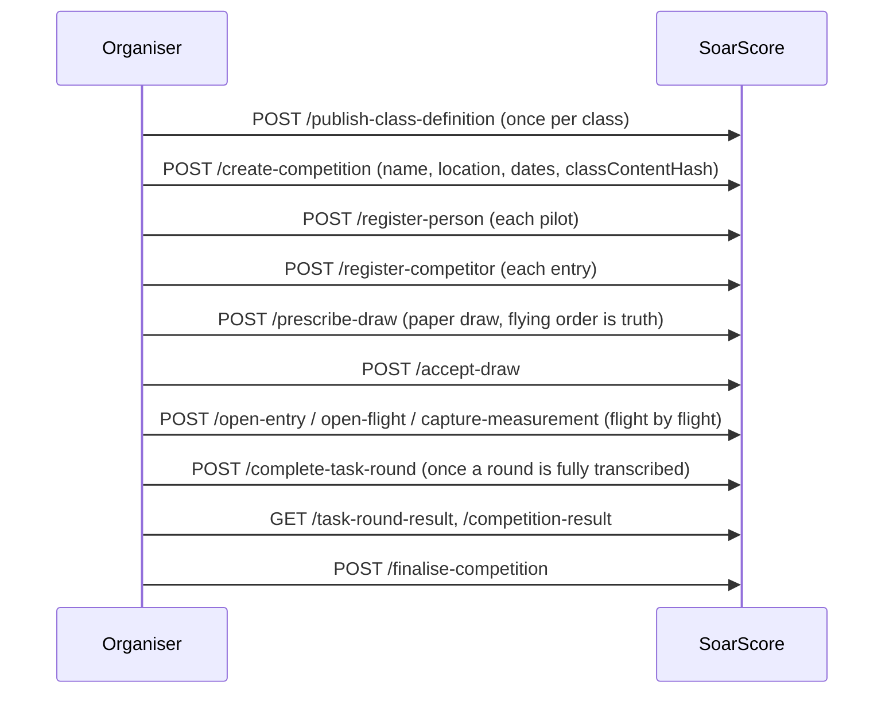
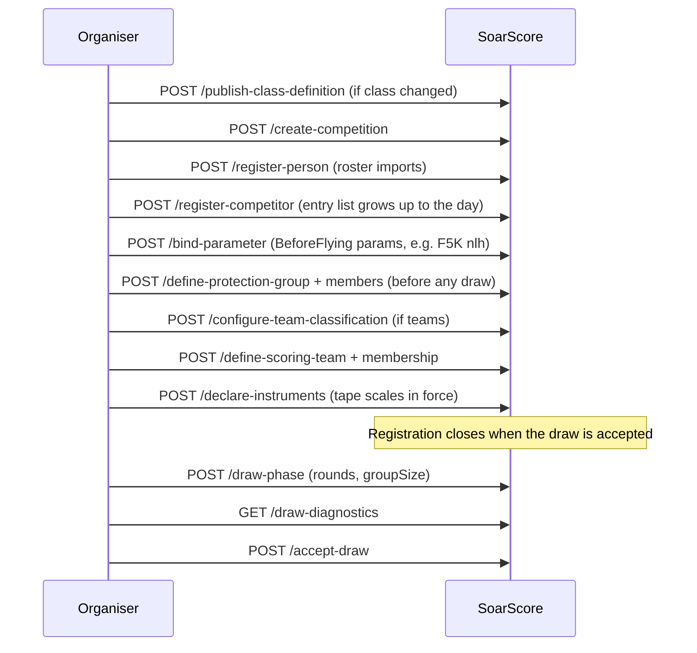
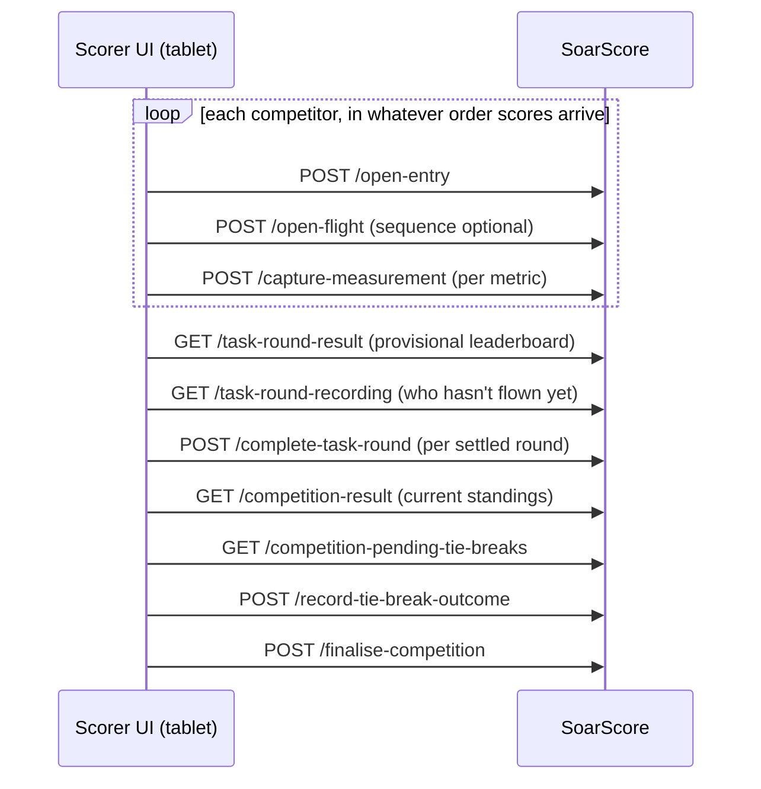
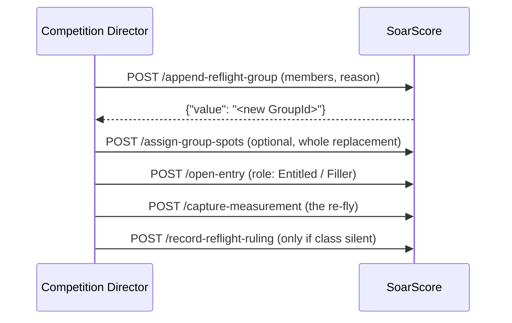

# SoarScore Integrators Guide

How to run a competition through the SoarScore HTTP API, and how to build a UI
on top of it. This guide is written for two audiences: an **integrator**
(club scorekeeper tooling, Gliderscore bridging, spreadsheet import) and a
**UI developer** (tablet/web front end).

> House-keeping: `docs/rules/` is derived from the official FAI/NZMAA rules and
> is read-only; everything here must not contravene them. This guide is
> transient software documentation — see docs house-keeping rules.

---

## 1. How the API thinks

Read this once; every use-case below assumes it.

- **One central route surface**: `MapCommand`/`MapQuery` only
  (`src/Soarscore.Api/Routing/EndpointRouteBuilderExtensions.cs`). Routes are
  kebab-case, **commands are verbs** (`/draw-phase`), **queries name the read**
  (`/competition-result`).
- **POST for commands, JSON body** (`{"competitionId":{"value":"<guid>"}, …}`).
- **GET for queries, query-string only** (`?competitionRef=<guid>&phaseOrdinal=0`).
  No route takes a body on GET or query-string parameters on POST.
- **IDs on the wire**: strong-typed ids (`PersonId`, `CompetitionId`,
  `EntryId`, `GroupId`, `ScoringTeamId`, `ProtectionGroupId`,
  `CompetitorId`) are **JSON objects** `{"value":"<guid>"}` in bodies and
  responses. In **query strings** they are bare Guid strings.
- **camelCase** property names; **enums are strings** (`"role": "Entitled"`,
  `"scope": "Flight"`); nulls omitted in responses; plain JSON numbers for
  measurements and scores.
- **Measured values** are kinded: `{"kind":"Number","number":412.3}` or
  `{"kind":"Flag","flag":false}`. A flag metric is how class data expresses
  timing validity (e.g. `launchedInWorkingTime`).
- **Ordinals**: `phaseOrdinal` is 0-based; `roundOrdinal` and
  `taskRoundOrdinal` are 1-based. Today there is a single live phase — always
  `phaseOrdinal: 0`.
- **Success**: `200 OK` with the bare value — `{"value":"<guid>"}` for
  id-returning commands, bare JSON string for `/publish-class-definition`,
  arrays/objects for queries. Commands that can carry advisories (draws)
  return `{"value": <T>, "warnings":[{"code":…, "message":…}]}` — always check
  for `warnings`.
- **Failure**: RFC 9457 ProblemDetails. `title` is a **stable machine-readable
  failure code** (`openEntry.alreadyOpen`), `detail` a human message, and
  `extensions.defects` carries validation defects when present. Status: codes
  ending `.notFound` → **404**; `eventStore.streamAlreadyExists` /
  `concurrencyConflict` / `uniqueConstraintViolation` → **409**; else **400**.
  Every command has exactly one defect code per failure — you can branch on
  the code without parsing `detail`.
- **No auth.** Auditability comes from the immutable event log; `by` fields
  record who acted, never enforced.
- **OpenAPI** is published (`/openapi/v1.json`).

### The one law: no imposed ordering (NFR-4)

Nothing ever gates on scores being up to date. You may capture flights in any
order, across competitors, groups, rounds and days; record a ruling before its
flight; complete rounds out of order; leave a round unentered (it is absent
from results, not zero). Validity is structural, never temporal. Corrections
(rulings, penalties, annulments, tie-break outcomes) are deliberately legal
even after a round was completed or the competition finalised. The leaderboard
is re-derived at read time from the log, so every read is current.

**A consequence for integrators**: results are computed per query. An
amendment, a late capture, or a correction costs a re-query — there is no
"scoring pass" you trigger. Score reads are cheap; re-query after every change.

---

## 2. Endpoint map

### Commands (POST)

| Route | Purpose |
|---|---|
| `/register-person` | Master data: a pilot. |
| `/rename-person` | Rename. |
| `/change-person-contact-details` | Update contact. |
| `/change-person-club-affiliation` | Update club. |
| `/publish-class-definition` | Publish a competition-class model; idempotent, returns content hash. |
| `/create-competition` | Create from a published class (by content hash). |
| `/register-competitor` | Enter a person into a competition. |
| `/withdraw-competitor` | Withdrawal (legal any time, even after finalisation). |
| `/draw-phase` | Generate a fair draw. |
| `/prescribe-draw` | Import an explicit draw (e.g. from paper or Gliderscore). |
| `/accept-draw` | Pivot: freezes field + setup parameters; entries may now open. |
| `/reject-draw` | Discard the phase (redraw is legal with no edit). |
| `/bind-parameter` | Bind a class parameter (e.g. `groupSize`), optionally round-scoped. |
| `/declare-instruments` | Declare reading instruments (tape scales, F5J-style). Empty set valid. |
| `/correct-instrument-declaration` | Whole-set correction, `reason` required, retroactive by re-derivation. |
| `/complete-task-round` | CD asserts a round is settled. Never inferred, never a side effect. |
| `/reopen-task-round` | From Complete or Annulled → Drawn; `reason` required. |
| `/annul-task-round` | Faulty round: contributes 0, doesn't count for drops or finalisation. |
| `/finalise-competition` | Freeze declared results from the derived score. |
| `/record-competition-penalty` | Penalty with scope TaskRound or Competition, subject required. |
| `/append-reflight-group` | Form a re-flight group; returns newly minted GroupId. |
| `/assign-group-spots` | Whole-replacement spot map for a group. |
| `/record-reflight-ruling` | Replacement/BetterOf when the class rule is silent. |
| `/record-tie-break-outcome` | Settle a pending tie from `GET /competition-pending-tie-breaks`. |
| `/define-scoring-team` | Define a scoring team. |
| `/define-protection-group` | Define a draw-protection group (before any live draw exists). |
| `/assign-scoring-team-membership` | One team per competitor. |
| `/clear-scoring-team-membership` | Before re-assigning to a different team. |
| `/add-protection-group-member` / `/remove-protection-group-member` | Draw protection editing. |
| `/configure-team-classification` | Enable/disable team scoring. |
| `/open-entry` | Open a competitor's entry in a group. Role: Original/Entitled/Filler. |
| `/open-flight` | Open a flight slot; explicit `sequence` for out-of-order typing. |
| `/capture-measurement` | Capture a metric value. First value only. |
| `/amend-measurement` | Correct a captured metric; original preserved; reason + by required. |
| `/annul-entry` | Kill an entry (protest, mis-open); the write dead-end. |
| `/record-entry-penalty` | Penalty with scope Flight or Entry. |

### Queries (GET)

| Route | Purpose |
|---|---|
| `/people` | Find people by name/email (at least one criterion). |
| `/person` | Person read by `id`. |
| `/class-definitions` | List published class models. |
| `/class-definition` | Full class model by `contentHash`. |
| `/competitions` | List competitions, optional date/class filters. |
| `/competition` | **Full folded competition state** (large; includes pairwise co-occurrence). |
| `/entries` | Filter by competitionRef and any coordinate. |
| `/task-round-recording` | Completeness indicator: counts and metric gaps per group. |
| `/task-round-result` | Group scores, raw + pre-normalisation, awaiting-capture diagnostics. |
| `/competition-result` | Current standings (always derived at read time). |
| `/competition-pending-tie-breaks` | Tie groups the ladder can't separate. |
| `/competition-teams` | Team rosters (scoring teams + protection groups). |
| `/competition-team-result` | Team standings: derived + declared. |
| `/draw-diagnostics` | Draw-protection violations (after the draw; not prescribed-draw). |

---

## 3. Use-case 1: NDC organiser — scores on paper, entered afterwards

The whole competition ran at the club field on paper. The system is used
**retrospectively** to compute and publish results. Nothing here depends on
being "in the moment" — the event log records facts as you enter them, and
scores never gate capture.

### Sequence



### The walkthrough

1. **Class model.** If the class is already published in the seed set
   (`tools/Soarscore.SeedData/json/`), look up its hash with
   `GET /class-definitions` — skip publishing.

   ```http
   GET /class-definitions?name=NZ%20ALES%20200&activeOnly=true
   ```

2. **Create the competition** from the class content hash:

   ```http
   POST /create-competition
   {"name":"NZMAA NDC 2026","location":"Club field","startDate":"2026-09-05",
    "endDate":"2026-09-05","classContentHash":"<hash from step 1>"}
   ```

   Response: `{"value":"<competitionGuid>"}`.

3. **People and entries.** Register each pilot, then each entry. Keep the
   returned PersonId and CompetitorId values; the competitor is what the draw
   and entries reference. A duplicate is refused with
   `competition.competitor.alreadyRegistered`.

4. **The paper draw is the draw.** Do **not** use `/draw-phase` — the flying
   order was already realised on paper. Import it faithfully with
   `/prescribe-draw`: one `PrescribedRound` per round, one `PrescribedGroup`
   per group, `competitors` in flying order. The list position is the single
   source of truth for ordinals — do not supply ordinals anywhere.

   ```http
   POST /prescribe-draw
   {"competitionId":{"value":"<competitionGuid>"},
    "rounds":[
      {"taskRef":"ALES200","groups":[
        {"competitors":[{"value":"<compA>"},{"value":"<compB>"},{"value":"<compC>"}]},
        {"competitors":[{"value":"<compD>"},{"value":"<compE>"},{"value":"<compF>"}]}]}],
    "by":"Pete Smith"}
   ```

   Check the `warnings` envelope (SHOULD-minimum advisories, e.g. group-size
   minima) and the returned GroupIds via `GET /competition?id=…` — the group
   objects live at `phases[0].rounds[n].taskRounds[m].groups[]`.

   `PrescribedBy` provenance is recorded. Note: a prescribed draw is **not**
   checked for protection-pair violations — that is the generator's business,
   and the CD already accepted the paper draw.

5. **Accept the draw.** `POST /accept-draw {"competitionId":{"value":"…"}}`.
   This freezes the field and setup parameters and is required before any
   entry can open (`entry.drawNotAccepted`).

6. **Transcribe the scores.** For each competitor's flight, in whatever order
   the paper comes:

   ```http
   POST /open-entry
   {"competitionRef":{"value":"…"},"phaseOrdinal":0,"roundOrdinal":1,
    "taskRoundOrdinal":1,"groupRef":{"value":"<groupGuid>"},
    "competitorRef":{"value":"<competitorGuid>"}}
   ```

   Then per flight slot, per metric. Paper is often out of order — use the
   explicit `sequence` so a flight typed late keeps its launch label:

   ```http
   POST /open-flight
   {"entryRef":{"value":"…"},"sequence":3}

   POST /capture-measurement
   {"entryRef":{"value":"…"},"flightSequence":3,"metric":"flightTime",
    "value":{"kind":"Number","number":587}}

   POST /capture-measurement
   {"entryRef":{"value":"…"},"flightSequence":3,"metric":"landingDistance",
    "value":{"kind":"Number","number":4.2}}
   ```

   If the class declares tape instruments, a captured instrument reading must
   be an **exact member** of the tape's reading set — never rounded or
   guessed (`captureMeasurement.readingNotOnScale`).

   Use `GET /task-round-recording?competitionRef=…&phaseOrdinal=0&roundOrdinal=1&taskRoundOrdinal=1`
   as your transcription checklist: `notRecordedCompetitorRefs` and
   `metricGaps` name exactly what the paper still owes. It states facts,
   never a verdict — presence of gaps proves *not ready*; absence never
   proves ready.

7. **Transcribed a whole round?** `POST /complete-task-round` (see §3.10 below
   for the lifecycle). Rounds may be completed out of order.

8. **Read results at any point** — provisional leaderboards are scored on
   what's present: `GET /task-round-result`, `GET /competition-result`.

9. **Finalise.** `POST /finalise-competition {"competitionRef":{"value":"…"},"by":"Pete Smith"}`
   — refused until the class's `MinRounds` (and `MinTasks`, F3B) are fully
   flown; annulled rounds don't count. Finalisation freezes the declared
   results; corrections after it remain legal and produce a readable
   declared-vs-derived divergence (never silently reconciled).

### Pitfalls specific to retrospective entry

- A second capture for the same (flight, metric) fails
  `captureMeasurement.alreadyCaptured`. The correction is `/amend-measurement`
  with `reason` and `by`.
- Flights may be opened in any order via explicit `sequence` — gaps are legal,
  duplicates are not (`openFlight.duplicateSequence`).
- If the paper draw was mis-transcribed and nobody has flown against it, see
  §4.9 (reject + re-prescribe). `prescribe-draw` requires **no live phase**,
  and rejection removes the phase entirely — re-prescribe with no other edit.

---

## 4. Use-case 2: National / international organiser — set up in advance, run live

The competition is created days or weeks before the event; scores enter live
through the day(s), from one or more scorekeepers on tablets at the field.

### Phase A — set up (before the event)



1. **Publish the class** if this year's class model changed
   (`POST /publish-class-definition` — full ClassDefinition document,
   idempotent by content). Adopt the hash in `/create-competition`.
2. **Create the competition early** and register people/competitors as the
   entry list builds. Nothing prevents adding entries up to the draw
   acceptance; after acceptance registration is closed
   (`competition.field.frozen`) — but `/withdraw-competitor` **never** closes.
3. **Bind parameters** the class wants before flying
   (`POST /bind-parameter` — `parameterName`, `value` as MeasuredValue,
   optional `roundOrdinal` for round-scoped resolution). After draw
   acceptance CompetitionSetup parameters freeze
   (`competition.parameter.frozen`); BeforeFlying parameters (F5K `nlh`)
   stay bindable.
4. **Draw protection** (if the class wants same-club pair separation): define
   protection groups **before any draw exists** — edits are refused while a
   live phase exists (`addProtectionMember.drawExists`). A rejected draw
   removes the phase and reopens editing.
5. **Teams**: define scoring teams, assign membership
   (one team per competitor; re-assignment to the same team flips
   `contributes`, a different team needs a clear first), and
   `POST /configure-team-classification {"enabled":true,"by":"…"}`.
6. **Declare instruments** — the whole SET in force (`POST /declare-instruments`;
   empty set is valid for distance-only classes). Changes afterwards are
   `/correct-instrument-declaration` with a `reason`, whole-set replacement,
   retroactive by re-derivation.
7. **Draw the phase**: `POST /draw-phase {"competitionId":{"value":"…"},"rounds":4,"taskRefs":["F5J"]}`.
   The generator forms the least-bad draw against protection pairs. Read the
   `warnings` envelope, then `GET /draw-diagnostics?competitionRef=…` for
   residual protection violations — the CD decides: `/accept-draw` or
   `/reject-draw`. Rejection removes the phase; re-draw with no other edit.
   Groups materialise in `GET /competition` at
   `phases[0].rounds[n].taskRounds[m].groups[]`.

### Phase B — run (during the event)



1. **Capture live.** For each drawn competitor in the current round: open an
   entry in their drawn group, open flight slots, capture measurements.
   Capture order is completely free — across competitors, groups, rounds,
   even across days (multi-day events simply keep drawing and capturing;
   nothing resets between days). The only refusals are structural:
   not drawn, withdrawn, `entry.drawNotAccepted`, `openEntry.alreadyOpen`,
   `openEntry.taskRoundClosed`.
2. **Keep the leaderboard running.** `GET /competition-result` and
   `GET /task-round-result` score whatever is present — unentered rounds are
   absent, incomplete flights read `Pending` with `awaitingCapture`
   diagnostics naming the missing metric. Drawn-but-not-Complete rounds still
   score, so the leaderboard is provisional by construction.
3. **Settle rounds.** `POST /complete-task-round` is the CD asserting scores
   are in and settled — never inferred. There is no "all groups flown" check
   on purpose. Use `GET /task-round-recording` as the CD's checklist.
4. **Pending ties.** A tie the comparator ladder can't settle surfaces on
   `GET /competition-pending-tie-breaks` (shared places are already assigned —
   pending is an annotation, never a gate). `POST /record-tie-break-outcome`
   with the halting directive and well-formed placings (≥2, distinct, dense
   numbering from 1, equal places allowed). The directive must be stated on
   the phase's ladder; the outcome is ranking-only, last-logged wins, and a
   non-matching outcome is inert. If scores later change, the outcome stops
   matching and the tie goes pending again.
5. **Finalise** at the end: `POST /finalise-competition`. It scores first
   (individuals + teams) and freezes the declaration
   (`GET /competition-result`, `GET /competition-team-result` — `derived` vs
   `declared`).

---

## 5. Use-case 3: Import a realised draw from another system

When migrating mid-stream from Gliderscore or a spreadsheet — or an event ran
day one outside the system — the paper/other-system draw is the truth. This is
`/prescribe-draw`, identical to use-case 1 step 4: import rounds/groups with
competitors in flying order, accept, and capture from that point. Keep
`by` (who imported) and check warnings. The log preserves the provenance
(`PrescribedBy`).

The same pattern covers **re-flights declared on paper**: `append-reflight-group`
with the members (§6.3), entries opened with role `Entitled`/`Filler`.

---

## 6. Use-case 4: Exceptions to the normal running

Read §1 "no imposed ordering" first: everything below is legal whenever the
fact is known, including after round completion or finalisation. The log is
always the audit trail; nothing here is gated on anything being current.

### 6.1 Withdrawal (`POST /withdraw-competitor`)

Legal **any time** — including after draw acceptance and after finalisation.
Effects: no new entries (`openEntry.competitorWithdrawn`); excluded from
future draw fields and reflight groups; spots read as vacant; completeness
"expected" drops by one. **Existing entries keep scoring** — past scores are
not touched. They can still be penalised and receive rulings/outcomes.
Cannot be re-added to team/protection memberships.

### 6.2 Annul an entry (`POST /annul-entry`)

`reason` + `by` required. The entry becomes a **write dead-end** — every
further command on it fails `entry.annulled`. Scoring effect: `NoResult`,
excluded from normalisation. The "second attempt" is a **new** entry via
`/open-entry` (an annulled Original never blocks). Re-annulment is allowed
(jury revises; fold overwrites) — there is deliberately no un-annul.

### 6.3 Re-flights (`/append-reflight-group` → `/assign-group-spots` → `/open-entry` → ruling)



1. `POST /append-reflight-group` — members must be registered, not withdrawn,
   ≥ the class's resolved `MinNewGroupSize`; refused on an annulled round;
   Complete rounds allowed (protest after read-out is the ordinary late case).
   Returns the newly minted GroupId.
2. Spots optional: `/assign-group-spots` replaces the whole spot map and must
   cover every live member.
3. Open entries with `role`:
   - **`Entitled`** — the re-flyer. Score slot: the class's `EntitledScores`
     (normally `Replacement` — the re-flight is official even if worse).
   - **`Filler`** — others drawn in to make up the group. Slot `OthersScore`
     (normally `BetterOf` — max of the two normalised scores). The Original
     still participates in group normalisation.
   - **Make-ups**: `countsForRoundOrdinal` + `reason` aggregate the score into
     an earlier round's ladder slot (validated: existing, earlier, same phase).
4. `POST /record-reflight-ruling` (Replacement|BetterOf) **only where the class
   rule is silent** (`UndefinedRequiresRuling` classes — F3B Task C, F5L, NZ M;
   otherwise `recordReflightRuling.classRuleSpeaks`). No pending-ness or
   entry-existence check — record whenever known; re-record to supersede
   (last-logged wins). If the class is silent and **no** ruling exists, the
   leaderboard fails `score.reflightRequiresRuling` — that refusal is the
   designed prompt to the CD.

### 6.4 Penalties (mis-behaviour after the fact)

```http
POST /record-entry-penalty          (scope: Flight or Entry)
POST /record-competition-penalty    (scope: TaskRound or Competition; competitorRef required)
```

- **Entry endpoint**: Flight/Entry-scoped, raw stage **pre-normalisation** —
  `Zero*` → the task-round cell becomes `NoResult`; `DeductPoints` → subtracted
  from raw before the 1000-basis winner is found (floored at 0), scaling
  inside the group ratio.
- **Competition endpoint**: TaskRound/Competition-scoped, aggregate stage —
  after drops, before ranking; `DeductPoints` is flat. A `Zero*`-carrying
  infraction requires the task-round coordinate.
- Both validate: infraction type declared by the adopted class
  (`infractionTypeNotDeclared`), permitted scopes include the recorded scope
  (`scopeNotAllowed`).
- One record = one occurrence; `OncePerAttempt` definitions accrue once.
- `Disqualify` is a **flag, not arithmetic** — excluded from placings, placing
  reads as 0 in the declared result, the score is still declared.
- No finalisation gate, no withdrawn check — the protest-after-contest case
  is the designed one.

### 6.5 Pending ties

See use-case 2 Phase B step 4. Pending ties **gate nothing** — shared places
are already assigned and the leaderboard is readable while a fly-off is
pending. An `EqualPlaces` directive is settled (the shared place *is* the
outcome) and never surfaces pending.

### 6.6 Round lifecycle & late scores

```
Drawn ──complete-task-round──> Complete
Drawn ──annul-task-round────> Annulled
Complete ──reopen-task-round─> Drawn
Annulled ──reopen-task-round─> Drawn        (erroneous annulment is correctable)
```

- Annul: `reason` required; a Complete round **may** be annulled (read out,
  then found faulty is the ordinary case). Effect: scores contribute 0, don't
  count for drop gates or finalisation validity. A wrongly annulled round is
  reopened — annulment is a resolution, not a dead-end.
- Late score after a completed round: `/reopen-task-round` (+ reason), capture,
  re-complete. Reopening never touches any Finalisation — a finalised-then-
  reopened competition shows a declared-vs-derived divergence **by design**;
  read it, never reconcile it. There is **no re-finalise today**.
- No cross-round ordering check: rounds may complete out of order, or not at
  all.

### 6.7 Mis-keyed score correction (`/amend-measurement`)

Capture is first-value-only (`captureMeasurement.alreadyCaptured`); every
correction is an amendment: `flightSequence`, `metric`, `newValue`, `reason`,
`by`, and the instrument **after** the amendment (restated to retain, null to
clear to a distance). Kind must match. Original measurement is preserved
append-only. Since results are derived per query, the correction costs a
re-query — nothing else. Launch timestamps are deliberately uncorrectable
because no rule wants a launch instant; timing validity is class flag data,
corrected by amendment like any measurement.

### 6.8 Instrument declaration corrections

`POST /correct-instrument-declaration` — only after a declaration; whole-set
replacement; `reason` required. Retroactive by re-derivation: the leaderboard
is re-derived per query from the declaration in force; the log keeps every
declaration, so the audit is independent. **Finalisation freezes composed
scores from the declaration in force at finalisation time.**

### 6.9 Draw exceptions (accept/reject/redraw)

```http
POST /reject-draw {"competitionRef":{"value":"…"},"reason":"Group sizes wrong"}
POST /draw-phase {"competitionId":{"value":"…"},"rounds":4,"taskRefs":["F5J"]}
POST /accept-draw {"competitionId":{"value":"…"}}
```

- Rejection is refused **only if entries exist against the phase**
  (`rejectDraw.entriesExist`).
- Allowed even on an **accepted** draw nobody has flown against — the ordinary
  correction path. Rejection *removes* the phase (there is no "rejected"
  state in the folded view) and thereby reopens registration, parameter binds
  and protection editing. The replacement draw gets the next phase ordinal.
- Redraw is legal with **no edit** anywhere — the same commands again.
- The log keeps every rejected draw; `GET /competition` shows only the live
  one (no draw-history read surface today — see `deferred-decisions.md`).

### 6.10 Score-read exceptions

A few refusals exist **on read** by design; branch on the code:

| Code | Meaning |
|---|---|
| `score.reflightRequiresRuling` | Class is silent on re-flight slot selection and no CD ruling recorded. Record one. |
| `score.reflightShapeUnsupported` | Reflight entry shape impossible to interpret — inspect `/entries` and annul the wrong one. |
| `score.reflightDestinationUnresolved` / `DestinationConflict` | A make-up `countsForRoundOrdinal` names a bad destination. |
| `score.zeroEffectUnanchored` | A zeroing penalty recorded without its task-round coordinate. |

---

## 7. Use-case 5: Building a UI on top of the API

The API is deliberately small and intent-shaped: your UI drives it as a
sequence of verbs, and all aggregation lives server-side. There are no
'class-specific' branches to write — variance between classes is inside the
published class model, and your UI reads the class definition to learn what
to display.

### 7.1 Read the class definition to render capture forms

`GET /class-definition?contentHash=<hash>` returns the class model:
`parameters[]` (what the CD binds and what tasks expect), tasks and their
`metrics[]` (what `/capture-measurement` accepts per flight), `reflight`
settings (`EntitledScores`/`OthersScore`/`MinNewGroupSize`),
`penalties[]` (infraction types + permitted scopes — the `record-*-penalty`
dropdowns), landing tape data, drop-worst, and the tie-break ladder.

Your capture form per flight = the task's metrics, each rendered by its
`MeasuredKind` (`Number` → numeric input; `Flag` → checkbox). Never invent a
metric name not on the task; the server refuses it. Flag metrics (e.g.
`launchedInWorkingTime`) render as validity checkboxes, not numbers.

### 7.2 Screen-to-screen map

| Screen | Reads | Writes |
|---|---|---|
| Entry list / registration | `/people`, `/class-definitions`, `/competitions` | `/register-person`, `/register-competitor`, `/withdraw-competitor` |
| Draw review | `/competition` (groups), `/draw-diagnostics`, draw warnings envelope | `/draw-phase` or `/prescribe-draw`, `/accept-draw`, `/reject-draw` |
| Score capture | `/entries`, `/task-round-recording` (gaps), `/task-round-result` | `/open-entry`, `/open-flight`, `/capture-measurement` |
| Corrections | `/task-round-result` (`awaitingCapture`) | `/amend-measurement`, `/annul-entry`, `/record-entry-penalty` |
| Round control | `/task-round-recording` | `/complete-task-round`, `/reopen-task-round`, `/annul-task-round` |
| CD console | `/competition-pending-tie-breaks`, `/competition-teams`, `/competition-result` | `/record-reflight-ruling`, `/append-reflight-group`, `/assign-group-spots`, `/record-tie-break-outcome`, `/record-competition-penalty`, `/finalise-competition` |
| Results display | `/competition-result`, `/competition-team-result`, `/task-round-result` | none (read-only) |
| Setup | `/competition`, `/class-definition` | `/bind-parameter`, `/declare-instruments`, `/correct-instrument-declaration`, teams + protection commands |

### 7.3 Wire behaviour your UI must honour

1. **Never gate capture on anything temporal** (NFR-4). Capture forms must be
   available whenever structurally possible. Disable on structural refusals
   only: not drawn, withdrawn, entry already open, round closed.
   `entry.drawNotAccepted` → show "draw pending", not an error.
2. **Poll, don't push.** There is no event stream on the HTTP surface. Poll
   `/competition-result` and `/task-round-recording` (e.g. 5s on a leaderboard
   screen) — scoring is cheap; re-derive per poll is the designed pattern.
3. **Handle the warnings envelope.** Any command response may be
   `{"value":…, "warnings":[…]}` — surface warnings, use `value` as the id.
   Today only draw commands produce them; unwrap generically anyway.
4. **Branch on failure codes, not messages.** `title` is stable; e.g.
   `openEntry.alreadyOpen` → disable the button;
   `captureMeasurement.readingNotOnScale` → hint "exact tape mark";
   `captureMeasurement.alreadyCaptured` → route to the amendment form.
   `.notFound` → 404; `.concurrencyConflict` → 409, refresh and retry.
5. **The amendment form needs `reason` and `by`** (server-validated). Same for
   annulments, rulings, tie-break outcomes, round lifecycle, instrument
   corrections. Render them as required fields.
6. **Ordinals discipline**: 0-based `phaseOrdinal`, 1-based
   `roundOrdinal`/`taskRoundOrdinal`. Single phase today.
7. **`GET /competition` is large** (whole folded state + pairwise
   co-occurrence). Don't poll it at leaderboard frequency; use the narrow
   queries (`/task-round-result`, `/task-round-recording`, `/entries`).
8. **`GET /people` requires a criterion** — the registration screen search
   must send `?name=…` or `?email=…`, never bare.
9. **Teams**: one team per competitor — the UI enforces clear-then-assign for
   a different team; the same-team re-assign flips `contributes` (the
   eligibility toggle). Protection-group editing screens must be disabled
   once any live phase exists (`addProtectionMember.drawExists`); they open
   again after a rejected draw.
10. **Out-of-order typing**: the paper-style capture screen should always let
    the scorer type flights in whatever order they occur, via explicit
    `sequence` on `/open-flight`. Never derive sequence positionally.
11. **Team standings read `derived` vs `declared`** on
    `/competition-team-result`; after a post-finalisation correction the two
    diverge — show the divergence (it is by design), never reconcile.

### 7.4 Minimal viable UI

Smallest viable scorer: draw review → per-group capture grid → round control
→ leaderboard. The capture grid polls `/task-round-recording` for gaps and
posts `/open-entry` → `/open-flight` → `/capture-measurement` per gap.
Everything else (CD console, teams, instruments) is optional and additive.

---

## 8. Quick reference: the canonical happy path

```http
# Class (idempotent)
POST /publish-class-definition          → contentHash

# Setup
POST /create-competition                → CompetitionId
POST /register-person                   → PersonId   (per pilot)
POST /register-competitor               → CompetitorId  (per entry)
POST /bind-parameter                    (optional)
POST /declare-instruments               (optional, empty set ok)
POST /define-protection-group + members (optional, before draw)
POST /configure-team-classification     (optional)

# Draw
POST /draw-phase  (or /prescribe-draw)  → GroupIds via GET /competition
POST /accept-draw                       → entries may open

# Fly & capture (any order, NFR-4)
POST /open-entry                        → EntryId
POST /open-flight                       (sequence optional)
POST /capture-measurement               (per metric)
GET  /task-round-recording              (completeness checklist)
GET  /task-round-result                 (provisional)

# Exceptions (any time, in any order)
POST /amend-measurement
POST /annul-entry            (+ new /open-entry)
POST /withdraw-competitor
POST /record-entry-penalty   / record-competition-penalty
POST /append-reflight-group  → open-entry(Entitled/Filler) → (record-reflight-ruling)
POST /record-tie-break-outcome
POST /reopen-task-round      / annul-task-round
POST /correct-instrument-declaration

# Settle & close
POST /complete-task-round               (per settled round)
GET  /competition-result                (standings, always current)
GET  /competition-pending-tie-breaks    (CD settles)
POST /finalise-competition              → declared results frozen
```
