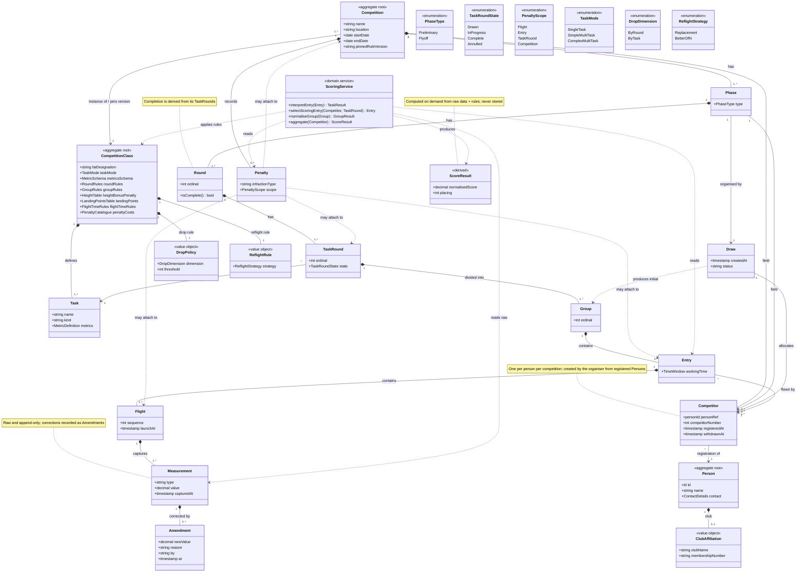

# RC Soaring Competitions — Domain Class Diagram

Class diagram for the RC soaring timing and scoring domain model. Captures the
compositional spine (Competition down to Measurement), the reference-data side
(CompetitionClass and its rule policies), and the scoring service as pure
derivation over raw data.

## Modelling notes

- **Aggregate roots are shaded yellow** — CompetitionClass, Competition, and Person. Per-aggregate boundary diagrams (one per root) are in `soaring-aggregates.md`.
- **Filled diamonds are composition, hollow arrows are references.** The whole
  spine Competition → … → Measurement is composition (the parts have no life
  outside their parent). CompetitionClass, Person, and Task are referenced
  by association because they are their own aggregates. The field itself now
  lives inside Competition: each Competitor is one person's registration into
  this one event, referencing the system-wide Person by id.
- **Person vs Competitor:** Person is the system-wide identity — name, contact
  details, club affiliation — created once when someone registers with the
  system. A Competitor is that person's participation in one competition: a
  reference to the Person, a competitor number, and registered/withdrawn
  timestamps. The organiser creates Competitors by picking from registered
  Persons; there is no self-service path. The registration process is in
  `soaring-registration.md`.
- **DropPolicy and ReflightRule are broken out as value objects** rather than
  buried as attributes, because their two dimensions (drop = ByRound vs ByTask;
  reflight = Replacement vs BetterOfN) are class-defined rules that vary between
  formats and deserve to be visible.
- **ScoringService only ever reads.** No arrow writes a score back onto any
  entity; `ScoreResult` is marked «derived» and produced on demand. This is the
  raw-first guarantee made visual — scores are computed from raw measurements
  plus pinned rules, never captured or stored authoritatively.
- **Penalty's four dashed arrows** are the polymorphic scope: a penalty may
  attach to a Flight, an Entry, a TaskRound, or the Competition as a whole. The
  `scope` enum plus a single reference is a valid alternative if polymorphic
  association is undesirable.
- **Round completion is derived** from the state of its TaskRounds, not stored
  as a flag — so partial annulment (weather kills some groups) is handled by
  filtering rather than by mutating a completion field.
- **Rule versioning:** Competition pins the CompetitionClass rule version at
  creation (`pinnedRuleVersion`) so historical results re-score deterministically
  even after the sporting code changes.

Several attributes are typed to value-object names (`MetricSchema`,
`HeightTable`, `LandingPointsTable`, etc.) rather than modelled as full classes,
to keep CompetitionClass legible. Promote any of them to a first-class type if
its internal structure becomes significant.
