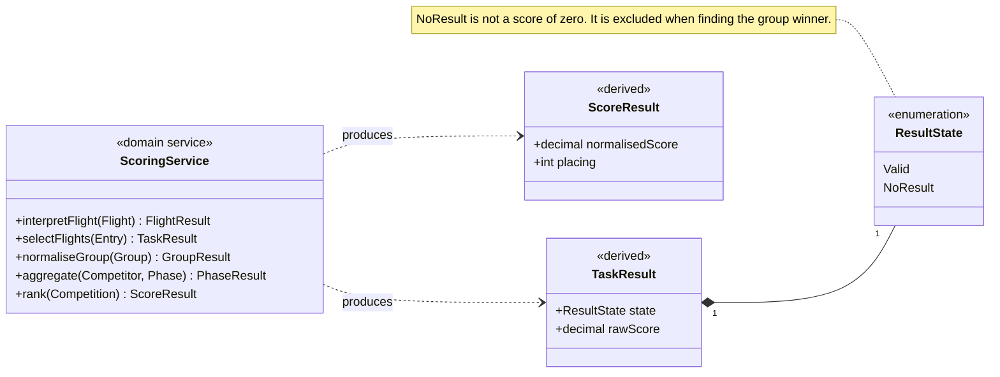

# RC Soaring Competitions — Domain Class Diagram

Class diagrams for the RC soaring timing and scoring domain model. Three views:
the compositional spine (Competition down to Measurement), the Competition Class
structure (phases and tasks), and the scoring vocabulary a class composes its
arithmetic from.

The class model carries all per-class variance (NFR-1). Nothing in the spine
branches on which class is being run.

---

## 1. The competition spine

```mermaid
classDiagram
    direction TB

    class Competition {
        <<aggregate root>>
        +string name
        +string location
        +date startDate
        +date endDate
        +string evaluatorVersion
    }

    class AdoptedRules {
        <<value object>>
        +ClassDefinition definition
        +string sourceClassId
        +string sourceVersion
        +timestamp adoptedAt
    }

    class RulesAmendment {
        +ClassDefinition definition
        +string reason
        +string by
        +timestamp at
    }

    class ParameterBinding {
        +string parameterName
        +MeasuredValue boundValue
        +string by
        +timestamp at
    }

    class Finalisation {
        +FinalisationScope scope
        +int revision
        +string by
        +timestamp at
    }

    class DeclaredResult {
        +competitorId competitorRef
        +decimal aggregate
        +int placing
        +bool promoted
    }

    class Person {
        <<aggregate root>>
        +id id
        +string name
        +ContactDetails contact
    }

    class Competitor {
        +personId personRef
        +int competitorNumber
        +timestamp registeredAt
        +timestamp withdrawnAt
    }

    class Phase {
        +PhaseType type
        +int ordinal
    }

    class Draw {
        +timestamp createdAt
        +string status
    }

    class Round {
        +int ordinal
        +isComplete() bool
    }

    class TaskRound {
        +int ordinal
        +TaskRoundState state
        +taskId taskRef
    }

    class Group {
        +int ordinal
    }

    class Entry {
        <<aggregate root>>
        +TimeWindow workingTime
        +ReflightRole role
    }

    class Annulment {
        <<value object>>
        +string reason
        +string by
        +timestamp at
    }

    class Flight {
        +int sequence
        +timestamp launchAt
    }

    class Measurement {
        +string metric
        +MeasuredValue value
        +timestamp capturedAt
    }

    class MeasuredValue {
        <<value object>>
        +MeasuredKind kind
        +decimal number
        +bool flag
    }

    class Amendment {
        +MeasuredValue newValue
        +string reason
        +string by
        +timestamp at
    }

    class Penalty {
        +string infractionType
        +PenaltyScope scope
    }

    class ClubAffiliation {
        <<value object>>
        +string clubName
        +string membershipNumber
    }

    class CompetitionClass {
        <<aggregate root>>
    }

    class PhaseType {
        <<enumeration>>
        Preliminary
        Flyoff
    }

    class TaskRoundState {
        <<enumeration>>
        Drawn
        InProgress
        Complete
        Annulled
    }

    class PenaltyScope {
        <<enumeration>>
        Flight
        Entry
        TaskRound
        Competition
    }

    class MeasuredKind {
        <<enumeration>>
        Number
        Flag
    }

    class ReflightRole {
        <<enumeration>>
        Original
        Entitled
        Filler
    }

    class FinalisationScope {
        <<enumeration>>
        Phase
        Competition
    }

    Competition "1" *-- "1" AdoptedRules : rulebook snapshot
    Competition "1" *-- "0..*" RulesAmendment : corrections
    Competition "1" *-- "0..*" ParameterBinding : choices made
    Competition "1" *-- "0..*" Finalisation : declared results
    Finalisation "1" *-- "1..*" DeclaredResult
    Competition "1" *-- "0..*" Competitor : field
    Competition "1" *-- "1..*" Phase : has
    Competition "1" *-- "0..*" Penalty : records
    Phase "1" *-- "1..*" Round : has
    Round "1" *-- "1..*" TaskRound : has
    TaskRound "1" *-- "1..*" Group : divided into
    Entry "1" *-- "1..*" Flight : contains
    Flight "1" *-- "1..*" Measurement : captures
    Measurement "1" *-- "1" MeasuredValue
    Measurement "1" *-- "0..*" Amendment : corrected by
    Entry "1" *-- "0..1" Annulment : voided by ruling
    Entry "1" *-- "0..*" Penalty : flight / entry scope

    Competitor "*" --> "1" Person : registration of
    Person "1" *-- "0..1" ClubAffiliation : club
    Phase "1" *-- "1" Draw : organised by
    Draw "1" --> "2..*" Competitor : allocates
    Draw ..> Group : produces initial
    Entry "*" --> "1" Group : flown in
    Entry "*" --> "1" Competitor : flown by
    TaskRound ..> AdoptedRules : task by id
    DeclaredResult ..> Competitor : for
    AdoptedRules ..> CompetitionClass : adopted from

    note for AdoptedRules "The whole rulebook, copied in at creation. Scoring reads this, never the library class."
    note for Measurement "Raw and append-only; corrections recorded as Amendments"
    note for Entry "A reflight is a second Entry; role decides which one counts"
    note for Finalisation "Captures what was declared; the raw record stays authoritative"

    classDef aggregateRoot fill:#FFE873,stroke:#E5B700,stroke-width:2px,color:#1A1A1A
    classDef external fill:#EEEEEE,stroke:#BDBDBD,stroke-width:1px,color:#555
    cssClass "Competition,Person,Entry" aggregateRoot
    cssClass "CompetitionClass" external
```



---

## 2. Competition Class — structure

The rulebook. An ordered list of phase definitions, each owning its own tasks
and aggregation; the class owns only what is genuinely true of the whole event.

```mermaid
classDiagram
    direction TB

    class CompetitionClass {
        <<aggregate root>>
        +id id
        +string name
        +string faiDesignation
        +string version
        +FinalRankingKind finalRanking
    }
    %% finalRanking is nullable, and absent means SinglePhase — the only value a
    %% one-phase class can take, so six of the eleven definitions no longer
    %% write it. It is not a default in the "invented rule" sense: the phase
    %% list forces it. Two adoption checks, one each way: SinglePhase on a class
    %% with more than one PhaseDefinition is rejected, and so is a multi-phase
    %% class that leaves it unset. It was a FinalRankingRule value object
    %% holding this one enum; the wrapper was removed as empty.

    class Parameter {
        +string name
        +MeasuredKind kind
        +MeasuredValue defaultValue
        +MeasuredValue[] allowedValues
        +ParameterBindingPoint boundAt
    }

    class ParameterRef {
        <<value object>>
        +string parameterName
    }
    %% A ParameterRef may stand in for a literal in exactly these thirteen slots,
    %% and nowhere else (validated at adoption):
    %%   TaskTiming.workingTime, TaskTiming.maxLaunches
    %%   RateTerm.cap, PiecewiseTerm.origin
    %%   Band.from, Band.to
    %%   GroupConstraint.minPerGroup
    %%   ValidityRule.minRounds
    %%   PromotionRule.topN, .minGroupSize, .maxGroupSize, .carryPenalties
    %%   ReflightRule.minNewGroupSize
    %% Band.from/.to were added for NZ Class M (F27), whose +1/-1 turning point
    %% is the CD-announced target time rather than a rule constant. Adjacent
    %% bands must still meet, so a parameter bound on one band's `to` and the
    %% next band's `from` must be the SAME parameter — checked at adoption.

    class PhaseDefinition {
        +int ordinal
        +PhaseType type
    }
    %% There is no `mandatory` flag. It was perfectly correlated with type
    %% across all eleven definitions, but only because it mis-recorded the one
    %% real case: 5.5.10 makes the F5K fly-off mandatory for seniors at World
    %% and Continental Championships, and F3K.9.1 the same at championships,
    %% and both were written "optional" because mandatoriness there is
    %% conditional on the EVENT LEVEL, which nothing in the model represents.
    %% Readmitting the flag needs that concept first, not another class.

    class RoundComposition {
        <<value object>>
        +CompositionKind kind
        +int tasksPerRound
        +bool requireDistinctTaskPerRound
        +int maxRounds
    }
    %% maxRounds is nullable; unset means the rules state no ceiling. It bounds
    %% what may be scheduled, which is why it is not on ValidityRule: a phase
    %% over its ceiling is not "invalid" in the sense minRounds means.

    class Task {
        +string code
        +string name
    }

    class DropPolicy {
        <<value object>>
        +DropDimension dimension
        +int dropCount
        +int applyWhenRoundsCompletedAtLeast
        +int applyWhenResultsAtLeast
    }
    %% Both gates are nullable and conjunctive: a drop applies only when every
    %% populated gate holds. F3B.2.8 states two — more than five complete rounds
    %% AND a task with more than five results — and they diverge whenever a
    %% group is annulled under F3B.1.8 c.
    %% A phase holds an ORDERED list of policies and the first whose gates all
    %% hold is the one that applies (F22). F3F.1.13 tiers the discard: one round
    %% at four or more, two rounds above fourteen. A single-element list is the
    %% case in all six original classes.
    %% The list may also be EMPTY, and empty means no discard. This was 1..*,
    %% and the notation carried a `drop none` sugar expanding to a single
    %% {ByRound, 0} so that a phase with no discard could satisfy it — the same
    %% mistake F25 found on Normalisation, and here the majority case: nine of
    %% the sixteen phases in seed-data/ have no discard, every fly-off among
    %% them. Discarding nothing does have an identity value, so nothing was
    %% mis-scored; what was wrong was recording a discard rule for a phase
    %% whose rules state none. F3K.10 and 5.5.11.13 apply their discards to the
    %% PRELIMINARY aggregate, which is why the fly-offs have nothing to state.

    class ValidityRule {
        <<value object>>
        +int minRounds
        +int minTasks
    }

    class PromotionRule {
        <<value object>>
        +PromotionKind kind
        +int topN
        +decimal topPercent
        +int minGroupSize
        +int maxGroupSize
        +bool carryPenalties
    }
    %% topN and topPercent are a two-way choice and exactly one is populated,
    %% per kind. Splitting PromotionRule into two subtypes was considered and
    %% declined: the divergence is one scalar on each side against three shared
    %% attributes, so a hierarchy would buy one sentence's worth of precision at
    %% the cost of two classes carrying an integer and a decimal. That is the
    %% same call MeasuredValue's number/flag pair already makes. PromotionKind
    %% therefore stays — it is the discriminator, and there is no subtype to
    %% take the job off it.
    %% minGroupSize, maxGroupSize and carryPenalties are common to both kinds
    %% and are unaffected either way; all three remain ParameterRef slots under
    %% PromotionRule's own name.

    class ReflightRule {
        <<value object>>
        +ReflightSelection entitledScores
        +ReflightSelection othersScore
        +int minNewGroupSize
    }
    %% minNewGroupSize is nullable, and absent is not "unstated". Where the
    %% rulebook is silent the class declares a no-default Parameter and the
    %% field holds a ParameterRef — F3B, F5L (5.5.12.9) and NZ Class M
    %% (NZ.3.12.5 l) all do. Absent means the field is INAPPLICABLE because no
    %% new group is ever formed: NZ Classes N and P permit no re-flight at all
    %% (NZ.3.13.1 h, NZ.3.15.1 h — F26), and F3F.1.5 re-flies one pilot into
    %% the running order. Zero is never correct; it would assert that a group
    %% of none is an acceptable minimum. Adoption rejects a populated
    %% minNewGroupSize where both selections are NotPermitted.

    class PenaltyDefinition {
        +string infractionType
        +string[] exclusionGroups
        +PenaltyAccrual accrual
    }
    %% accrual defaults to OncePerAttempt, which is what F3K.4.3 and F3J.2.4 c
    %% require literally ("each flight attempt may only incur a single penalty")
    %% and what all six original classes assume. PerOccurrence multiplies the
    %% deduction by the number of recorded occurrences: F3F.1.10 penalises a
    %% safety-plane crossing "by 100 points each" (F23).

    class PenaltyEffectSpec {
        <<value object>>
        +PenaltyEffect effect
        +decimal points
    }
    %% There is no appliedAt: the pipeline stage is a property of the EFFECT,
    %% not a second choice on top of it. DeductPoints and Disqualify act on the
    %% final aggregate; ZeroFlight, ZeroRound and ZeroTask act on the raw score,
    %% which is the only stage at which a flight or a round is still a
    %% distinguishable thing to zero. All eleven definitions agreed before the
    %% attribute was removed — 24 deductions and one disqualification at the
    %% final aggregate, 13 zeroes at the raw score — and the unused pairings are
    %% not statable rules. §4 below is where the pipeline reads the derivation.
    %% Disqualify is the odd one: it is not an arithmetic operation on a score
    %% at all, it removes the competitor from the ranking (F3F.1.2). It has no
    %% stage of its own to disagree about, and grouping it with the aggregate
    %% effects is what the one definition using it already assumed.
    %% One infraction may still carry several effects at different pipeline
    %% points, precisely because the effects differ: F3B.2.2 p zeroes the flight
    %% AND deducts 1000 from the final score; F3K.4.1 deducts AND zeroes the
    %% whole round.
    %% exclusionGroups is a list and may be EMPTY. Within one flight attempt at
    %% most one penalty from a group applies, the largest winning (F3K.4.3,
    %% F3J). A group may contain only DeductPoints effects — "largest" is
    %% undefined across effect kinds — and that is validated at adoption.
    %% "Largest" compares each definition's accrued contribution, not its
    %% points: two PerOccurrence crossings contribute 200, and F3F.1.10's 1000
    %% point person-contact still supersedes them. With every member
    %% OncePerAttempt the contribution IS the points, so F3K and F3J are
    %% unchanged by the refinement.
    %% The list is a list because exclusion is PAIRWISE, not an equivalence
    %% class (F28). F3F.1.10 excludes {crossing, person} and {object contact,
    %% person}, but a crossing is "an additional penalty" alongside an object
    %% contact and the two ADD. One group per definition can state any two of
    %% those three facts and never all three; membership of two groups states
    %% all three — crossing {safetyMax}, object {contact}, person {contact,
    %% safetyMax}. Ten of the eleven definitions name one group or none.
    %% Suppression is computed in ONE PASS from the recorded infractions, not
    %% iteratively from the survivors: a definition is suppressed if any group
    %% it belongs to holds a larger accrued contribution, and every definition
    %% that survives is applied exactly once however many groups it is in.
    %% Iterating would make the result depend on evaluation order — a
    %% suppressed member could otherwise un-suppress a third — and no rule asks
    %% for that.

    class CompositionKind {
        <<enumeration>>
        FixedSequence
        ChooseFromCatalogue
    }

    class DropDimension {
        <<enumeration>>
        ByRound
        ByTask
    }

    class PromotionKind {
        <<enumeration>>
        TopN
        TopPercent
    }

    class FinalRankingKind {
        <<enumeration>>
        SinglePhase
        LastPhaseReplaces
        SplitByPromotion
    }

    class ReflightSelection {
        <<enumeration>>
        Replacement
        BetterOf
        NotPermitted
        UndefinedRequiresRuling
    }
    %% NotPermitted (F26) is a rule that DEFINITELY grants no re-flight — NZ
    %% 3.13.1 h and 3.15.1 h, "no re-flights are permitted". Distinct from
    %% UndefinedRequiresRuling, which asserts the rulebook is silent and a CD
    %% must decide. Conflating them would put a ruling in front of the CD that
    %% the rules have already made.

    class PenaltyEffect {
        <<enumeration>>
        DeductPoints
        ZeroFlight
        ZeroRound
        ZeroTask
        Disqualify
    }

    class PenaltyAccrual {
        <<enumeration>>
        OncePerAttempt
        PerOccurrence
    }

    class ParameterBindingPoint {
        <<enumeration>>
        CompetitionSetup
        BeforeFlying
        PerRound
    }

    CompetitionClass "1" *-- "1..*" PhaseDefinition : ordered
    CompetitionClass "1" *-- "0..*" Parameter : declares
    ParameterRef ..> Parameter : resolves to (validated at adoption)
    CompetitionClass "1" *-- "1" ReflightRule
    CompetitionClass "1" *-- "0..*" PenaltyDefinition
    PenaltyDefinition "1" *-- "1..*" PenaltyEffectSpec
    PhaseDefinition "1" *-- "1" RoundComposition
    PhaseDefinition "1" *-- "1..*" Task : catalogue
    Task "1" *-- "0..1" ReflightRule : overrides the class default
    PhaseDefinition "1" *-- "0..*" DropPolicy : ordered, first match wins
    PhaseDefinition "1" *-- "1" ValidityRule
    PhaseDefinition "1" *-- "0..1" PromotionRule : entry criteria

    note for PhaseDefinition "A flyoff changes working times, caps, available tasks and penalty carry-over. Those rules live here, not on the class."
    note for ReflightRule "Two roles, one event: the entitled competitor takes the reflight; everyone else in the group takes the better of two. The class states the default; a Task overrides it where its rules differ."

    classDef aggregateRoot fill:#FFE873,stroke:#E5B700,stroke-width:2px,color:#1A1A1A
    cssClass "CompetitionClass" aggregateRoot
```



---

## 3. Competition Class — the scoring vocabulary

What a Task composes to turn measurements into points. This is the closed
vocabulary NFR-2 refers to: the scoring process interprets these generically and
has no notion of landings, launch heights, laps or motor runs.

```mermaid
classDiagram
    direction TB

    class Task {
        +string code
        +string name
    }

    class MetricDefinition {
        +string name
        +MeasuredKind kind
        +string unit
        +bool declaredBeforeLaunch
    }
    %% Capture precision is 0..1, not 1: a Flag metric has nothing to round, so
    %% no Flag in seed-data/ writes one. Where a Number metric's rules state no
    %% capture precision the definition still chooses one and says so — that is
    %% an F12 residual, not an omission (F5J landingDistance, 5.5.11.12 i).

    class FlightSelection {
        <<abstract>>
    }
    %% Five kinds, and the kind IS the type. What each may hold is a table
    %% rather than a sentence — `count` says nothing to Last or All,
    %% `rankByMetric` nothing to four of the five, `targets`/`targetValues`
    %% nothing to three — so the table is drawn instead of written. Fourteen of
    %% the corpus's thirty selections are `last` or `all` and carry no operand
    %% at all. The SelectionKind enum went with the split: a subtype and a tag
    %% naming that subtype are two records of one fact, and only one of them
    %% can be wrong.

    class LastFlight {
        <<value object>>
    }

    class AllFlights {
        <<value object>>
    }

    class LastNFlights {
        <<value object>>
        +int count
    }

    class BestNFlights {
        <<value object>>
        +int count
        +string rankByMetric
        +TargetAssignment targets
        +decimal[] targetValues
    }

    class ExactlyNInOrder {
        <<value object>>
        +int count
        +TargetAssignment targets
        +decimal[] targetValues
    }
    %% targetValues are in the UNITS OF THE METRIC the task's scoring term
    %% consumes, not in points. Each selected flight's metric is clamped to its
    %% assigned target, then scored.
    %% rankByMetric is nullable and only meaningful to BestN, which is why it is
    %% on BestNFlights and nowhere else. Null ranks the candidate flights by
    %% score (F3K.11.5, Poker: an achieved target credits the target, so score
    %% is the only ordering that means anything). Set, it ranks by that metric's
    %% raw value — F3K.11.8 assigns targets to the four longest FLIGHTS, and no
    %% flight has a score until a target has been assigned to it, so ranking by
    %% score there is circular.
    %% One residual: ExactlyNInOrder's `targets` can only ever be InOrder, since
    %% the subtype's name is that statement. It stays because the notation
    %% writes `targets inOrder` and rule 1 requires the operand to name a model
    %% element; removing it is a notation change, not a diagram one.

    class ScoreTerm {
        <<abstract>>
        +ScoreStage applyAt
    }
    %% Five kinds with disjoint payloads, drawn as five subtypes. Nothing but
    %% applyAt is common to all of them: a cap and a capScope belong to a rate
    %% and only ever appear on one (17 sites in seed-data/, all `rate`); an
    %% origin belongs to a piecewise (F5) and only ever appears on one; a value
    %% belongs to a constant; a metricRef means nothing to a constant or a
    %% conditional, neither of which reads a measurement. Held on one class
    %% these were six attributes and four associations of which any instance
    %% populated two or three, with nothing in the model saying which — the
    %% diagram admitted a Rate carrying a Band list, which the notation has
    %% never been able to write. ScoreTermKind is gone for the same reason
    %% SelectionKind is.
    %% applyAt defaults to RawScore: the term contributes to the value that
    %% normalisation consumes, which is what all seven FAI classes want — F5J
    %% and F5L normalise their landing bonus along with the flight time.
    %% Normalised terms are added AFTER normalisation and are not scaled by it
    %% (F24). NZ Class M 3.12.1 e states it outright: "landing points will be
    %% added to the normalized flight score". The two orders give different
    %% scores and, in a close group, a different ORDER — so this is not a
    %% rounding difference.
    %% A Normalised term is meaningless on a task with no Normalisation, and a
    %% task whose ONLY terms are Normalised has no raw score to normalise.
    %% Both are rejected at adoption.

    class RateTerm {
        +string metricRef
        +decimal rate
        +decimal cap
        +CapScope capScope
    }
    %% cap clamps the METRIC consumed, not the points produced, and capScope
    %% says whether it clamps each flight or their sum (F4a). Both are nullable:
    %% an uncapped rate is the ordinary case.

    class LookupTerm {
        +string metricRef
    }

    class PiecewiseTerm {
        +string metricRef
        +decimal origin
    }
    %% origin is nullable and means 0 — bands are evaluated over
    %% (metric - origin). F5K's launch points are per metre relative to an
    %% announced height, which is the whole of F5.

    class ConstantTerm {
        +decimal value
    }

    class ConditionalTerm {
    }
    %% No attributes of its own: a conditional is its predicate and its
    %% branches, and both are associations below.

    class Band {
        <<value object>>
        +decimal from
        +decimal to
        +decimal ratePerUnit
    }
    %% Bands are cumulative and are evaluated over (metric - PiecewiseTerm.origin).
    %% from and to accept a ParameterRef (F27).

    class LookupRow {
        <<value object>>
        +decimal upTo
        +decimal points
    }
    %% upTo is nullable; null means unbounded. Legal only on the last row; validated at
    %% adoption (rows ascending, at most one unbounded, and it must be last).

    class Predicate {
        <<abstract>>
    }
    %% "Exactly one of {leaf comparison, allOf} is populated" was the only one of
    %% these constraints the model ever wrote down, and the only one that had to
    %% be checked at adoption. Two subtypes state it instead, so the check is
    %% gone from the inventory in high-level-architecture.md rather than moved.
    %% There is still no anyOf: every multi-condition site in the eleven
    %% definitions is a conjunction, and disjunction is readmitted with the
    %% first rule that cites it.

    class Comparison {
        <<value object>>
        +string leftMetricRef
        +Comparator op
        +string rightMetricRef
        +decimal rightValue
    }
    %% The right-hand side is a metric or a literal and exactly one is
    %% populated. That one is deliberately NOT split further: it is a choice of
    %% VALUE, not of structure, and the model already carries that idiom in
    %% MeasuredValue's number/flag pair. Two leaf types to hold one operand
    %% would cost more than the sentence.

    class AllOf {
        <<value object>>
    }
    %% 2..* children, because a one-element conjunction is a wrapper around its
    %% own child and the notation's `all(<p>, <p>, …)` cannot write one.

    class TaskTiming {
        <<value object>>
        +WorkingTimeKind kind
        +duration workingTime
        +duration preparationTime
        +int maxLaunches
    }
    %% workingTime is populated if and only if kind is Fixed; under
    %% UntilAllFlightsComplete the working time is not a class datum at all —
    %% the round ends when the last flight does (F3K.9.3, F3F.1.7, NZ.3.12.1 h).
    %% Drawing that as two subtypes was considered and declined: it is one
    %% sentence about one nullable field, where ScoreTerm's and
    %% FlightSelection's constraints are tables, and two classes carrying one
    %% duration between them read worse than the sentence. WorkingTimeKind
    %% stays for the same reason — here the enum is still doing the work.
    %% maxLaunches is nullable, and unset means the task limits launches not at
    %% all — half the corpus. The notation writes nothing rather than a word for
    %% "unlimited"; a limit the rules leave to the CD is a ParameterRef instead.

    class GroupConstraint {
        <<value object>>
        +int minPerGroup
        +int minValidResults
    }
    %% minValidResults is nullable; unset means the class states no annulment
    %% threshold, and no group is annulled for want of valid results.
    %% Optional on Task, and ABSENT IS NOT THE SAME STATEMENT AS A
    %% PARAMETERISED minPerGroup. The two were written almost identically and
    %% mean different things:
    %%   absent                      -> the class does not GROUP-SCORE at all.
    %%     No pilot's score depends on another's, so there is no scoring group
    %%     to size and none to annul. NZ Classes N and P (3.13.1 i, 3.15.1 i)
    %%     and Class M's NDC format (3.12.7 c) total raw points per pilot. All
    %%     three used to write minPerGroup 1 and call it the degenerate value;
    %%     1 is a fabricated rule, and it also tells the DRAW that a group of
    %%     one is an acceptable split.
    %%   minPerGroup = ParameterRef  -> the class DOES group-score and the
    %%     rulebook does not state the size. F5K (5.5.10), F5L (5.5.12.4) and
    %%     NZ Class M (3.12, "Man-On-Man (Group scored)"), where the CD chooses
    %%     at setup and the choice enters the event log (F12).
    %% Downstream, absent means the draw takes no size constraint from the task
    %% — the core's "a field smaller than minPerGroup flies as one group"
    %% invariant simply does not engage — and no group is ever annulled. Since
    %% a task with no Normalisation reads nothing from its group, neither
    %% absence can move a score. Adoption rejects a task that has a
    %% Normalisation and no GroupConstraint: normalisation is defined against
    %% the best score in the group, so the class must say how groups form.

    class Normalisation {
        <<value object>>
        +NormalisationDirection direction
        +int winnerScore
    }
    %% Optional on Task (F25). Absent means the task does not normalise at all:
    %% the raw score IS the task result and rounds aggregate raw points. Every
    %% FAI class normalises, so this was 1..1 until the NZ classes; ALES 123 and
    %% ALES Radian say "each flight counts, the final score is the total of all
    %% points over three flights" (3.13.1 i, 3.15.1 i). There is no identity
    %% value for normalisation, so absence is the only truthful encoding.

    class Rounding {
        <<value object>>
        +RoundingMode mode
        +decimal precision
    }

    class TargetAssignment {
        <<enumeration>>
        None
        AnyOrder
        InOrder
    }

    class CapScope {
        <<enumeration>>
        PerFlight
        PerTask
    }

    class ScoreStage {
        <<enumeration>>
        RawScore
        Normalised
    }

    class Comparator {
        <<enumeration>>
        LessThan
        LessOrEqual
        GreaterThan
        GreaterOrEqual
        EqualTo
    }

    class WorkingTimeKind {
        <<enumeration>>
        Fixed
        UntilAllFlightsComplete
    }

    class NormalisationDirection {
        <<enumeration>>
        HigherIsBetter
        LowerIsBetter
    }

    class RoundingMode {
        <<enumeration>>
        Truncate
        HalfUp
        Ceiling
    }

    FlightSelection <|-- LastFlight
    FlightSelection <|-- LastNFlights
    FlightSelection <|-- BestNFlights
    FlightSelection <|-- AllFlights
    FlightSelection <|-- ExactlyNInOrder

    ScoreTerm <|-- RateTerm
    ScoreTerm <|-- LookupTerm
    ScoreTerm <|-- PiecewiseTerm
    ScoreTerm <|-- ConstantTerm
    ScoreTerm <|-- ConditionalTerm

    Predicate <|-- Comparison
    Predicate <|-- AllOf

    Task "1" *-- "1..*" MetricDefinition : records
    Task "1" *-- "1" FlightSelection : which flights count
    Task "1" *-- "1..*" ScoreTerm : staged by applyAt
    Task "1" *-- "1" TaskTiming
    Task "1" *-- "0..1" GroupConstraint
    Task "1" *-- "0..1" Normalisation
    Task "1" *-- "0..1" Predicate : validWhen
    Task "1" *-- "0..1" Predicate : flightValidWhen
    Task "1" *-- "0..1" Rounding : of the raw score
    MetricDefinition "1" *-- "0..1" Rounding : capture precision
    Normalisation "1" *-- "0..1" Rounding : of the normalised score
    PiecewiseTerm "1" *-- "1..*" Band : cumulative, ordered
    LookupTerm "1" *-- "1..*" LookupRow : ascending, ordered
    AllOf "1" *-- "2..*" Predicate : conjunction
    ConditionalTerm "1" *-- "1" Predicate : when
    ConditionalTerm "1" *-- "1..2" ScoreTerm : then / else
    %% Each of these five multiplicities was 0..* or 0..1 or 0..2 while every
    %% term was one class, because a Constant has no bands and a Rate has no
    %% predicate. On the subtype the lower bound is what the construct actually
    %% requires: a piecewise with no bands, a lookup with no rows and a
    %% conditional with no `when` are all unwritable in the notation and are now
    %% unstorable too.
    %% A ConditionalTerm with one child has only a `then`: the unmatched branch
    %% contributes 0 to the sum, which is why the notation need not write it.
    %% A non-zero fallback is a real second child — F5K's launch-altitude term
    %% keeps its `else`, because under 30 s the height penalties still apply
    %% while the bonus does not (5.5.10.4).
    RateTerm ..> MetricDefinition : reads
    LookupTerm ..> MetricDefinition : reads
    PiecewiseTerm ..> MetricDefinition : reads
    Comparison ..> MetricDefinition : compares

    note for ScoreTerm "No subtype is named for a discipline concept: a landing table is a LookupTerm over a distance metric, a launch-height penalty a PiecewiseTerm over a height metric."
    note for Band "Bands are cumulative: 1 pt/s to 600 s then -1 pt/s scores 599 at 601 s."
    note for Normalisation "Direction is per task: F3B Speed inverts, because the lowest time wins."
    note for Predicate "Two gates, different outcomes: validWhen decides whether the TASK has a result at all; flightValidWhen zeroes one flight while leaving it selectable."

    classDef aggregateRoot fill:#FFE873,stroke:#E5B700,stroke-width:2px,color:#1A1A1A
```



---

## 4. Scoring

`ScoringService` is a domain service, not an aggregate. It reads the rulebook
from the Competition's own copy, structure from the Competition, and raw data
from the Entries.



**The pipeline is fixed and core-owned; every stage takes class data.**

```
capture → interpret flight → select flights → assemble raw → clamp → round
  → normalise → add normalised terms → round → aggregate phase → drop
  → apply penalties → rank
```

Classes disagree about *where* in this sequence things happen, which is why the
order is explicit. A penalty lands at either end of it, and a single clause can
do both: `5.5.11.10 d` zeroes the round at the raw score while `5.5.11.10 b`,
two items above it, deducts 100 from the final aggregate, and `5.5.10.12` splits
the same way (`zeroFlight`/`zeroRound` at the raw score, `deduct 300` from the
final score). **The pipeline reads that split off `PenaltyEffectSpec.effect`,
which is the only place it is recorded.** `DeductPoints` and `Disqualify` are
applied at `apply penalties`, the last stage before `rank`. `ZeroFlight`,
`ZeroRound` and `ZeroTask` are applied at the raw-score end — before
`normalise`, and so before `aggregate phase` and `drop` — because that is where
the flight, round or task they name is still a distinguishable thing to zero.
The class data does not choose between the two, and no clause in the eleven
definitions wanted the other pairing: a deduction taken before `normalise`
would be rescaled by it, which no rule asks for, and a zeroed flight has no
referent once the aggregate exists.

Rounding disagrees too — F5K truncates the raw score to whole
points, then normalises, then rounds again (`5.5.10.15`), where F5J rounds
neither (`5.5.11.12 m`). And NZ Class M adds its landing bonus *after*
normalising where F5J and F5L add theirs before (F24), which is the `add
normalised terms` stage below.

The claim previously made here — that F3J subtracts penalties before
normalising — was wrong and is withdrawn. `F3J.10.10`'s group-winner formula
reads that way, but `50-f3j.class` rules that the specific clauses govern
(`F3J.2.4 d`, `F3J.7 d`, `F3J.8.3`, each "from the competitor's final score")
and puts every F3J penalty at the final aggregate; the "minus penalty points"
in `F3J.10.10` is the derived −30 overfly deduction (`F3J.10.3`), a score term.

Two stages are skipped rather than parameterised when a class is silent.
`normalise` is a no-op where the task has no `Normalisation` — the NZ ALES
classes aggregate raw points — and `add normalised terms` is a no-op wherever no
term sets `applyAt Normalised`, which is every FAI class. NZ Class M is the only
definition in `seed-data/` that uses the stage, and it is the reason the stage
is named separately rather than folded into `assemble raw`.

**Every stage is flight-local or later.** `interpret flight` sees one `Flight`'s
`Measurement`s and the `flight.sequence` intrinsic — never its siblings, never
task-level values, and never arithmetic between them. `select flights` is the
first stage that sees the whole `Entry`, and it is the only one that needs to.
Three FAI rules push on that boundary and all three are answered without moving
it: `F3K.11.8` by `BestNFlights.rankByMetric` (selection legitimately sees
every flight already), `F3K.9.3` by a captured flag read through
`Task.flightValidWhen`, and `F3K.7`'s per-task sum limit by a core invariant on
capture rather than by class data. See `high-level-architecture.md`.

`select flights` is also where an **annulled Entry** drops out: it yields no
result, exactly as a task failing `validWhen` does, and is ignored when finding
the group winner. That is a ruling the Entry carries, not class data, so no
stage reads anything new from `AdoptedRules` for it.

---

## Modelling notes

- **Aggregate roots are shaded yellow** — CompetitionClass, Competition, Person
  and Entry. Per-aggregate boundary diagrams are in `aggregate-roots.md`.
- **The Competition owns its rulebook.** `AdoptedRules` is the whole class
  definition copied in at creation, with provenance (which library class and
  version it came from) and the evaluator version that interprets it. Scoring
  never reads the library `CompetitionClass`, so editing or deleting a class in
  the library cannot perturb a running or finished event. The version pin it
  replaces only worked if nobody ever edited seed data in place.
- **Rulebook corrections are retroactive.** A `RulesAmendment` applies to the
  whole competition, not from a point in time. This costs nothing because
  results are derived — the next query simply returns corrected numbers — and it
  is what you want when a transcription error is found at round 3.
- **Parameters vs bindings.** The class declares what may vary (`Parameter`);
  the Competition records what was chosen and when (`ParameterBinding`). They
  are bound at different moments — F5K's height reference from the measured
  wind the day before, F3K's task selection per round, a flyoff cut at the end
  of qualifying. Bindings must be recorded as they happen or re-scoring is not
  reproducible. A `ParameterRef` is how a definition *consumes* one, and it is
  legal only in thirteen slots — a working time, a
  launch cap, a band origin, a band bound, a group minimum, a minimum-rounds
  rule, a promotion size, penalty carry-over, a reflight group minimum.
  `allowedValues`
  records the bounds where the rules state them, so a binding can be validated
  rather than trusted.
- **Rule-silence is a parameter, not a default.** Where a rulebook simply does
  not say — whether penalties carry into a flyoff, how large the flyoff is —
  the class declares a parameter with *no default*, so the CD chooses at setup
  and the choice enters the event log. The alternative, a sensible default, is
  the software inventing a rule and hiding it. Reading a definition for `no
  default` finds every place its rulebook is silent.
- **Phases own their scoring rules.** A flyoff is not a shorter preliminary: it
  changes working times, points caps, which tasks are available, and whether
  penalties carry over. `PhaseDefinition` holds all of it;
  `CompetitionClass.finalRanking` says how phases combine, and its three
  variants exist because the classes genuinely disagree — a single phase, a
  flyoff replacing preliminary points, or qualifiers and non-qualifiers ranked
  on different bases. Only the last two have to be written: with one phase the
  first is the only possibility, so the field is left unset there.
- **Tasks own everything that varies per task.** The test applied throughout:
  *if it varies between tasks, it belongs on the Task.* F3B settles this on its
  own — within one class its group minima, flight-time precision, landing table
  and normalisation direction all differ per task.
- **Score terms replace named rule slots.** There is no `landingPoints` or
  `heightBonusPenalty` attribute, because naming them puts a discipline concept
  in the core. A landing table is `Lookup` over a distance metric; a launch
  height penalty is `Piecewise` over a height metric; F3B's −1 pt/s beyond 600 s
  is a second cumulative band on the same term as the flight points. A term's
  `cap` clamps the *metric consumed*, not the points produced, and `capScope`
  says whether it clamps each flight or their sum — F5K caps total flight time
  across a task while leaving the launch-height bonus outside the cap.
- **Bands are cumulative.** A piecewise term applies each band's rate to the
  portion of the measurement falling inside it. This is what lets one term type
  express both F3B's overtime deduction and F5J's two-slope height penalty.
  Bands are measured from `PiecewiseTerm.origin`, which defaults to zero: F5K's
  launch points are per metre *relative to an announced height*, so its bands
  read from a parameter rather than from nothing. A band *bound* may also read a
  parameter: NZ Class M's +1/−1 turning point is the target time the CD
  announces on the day, not a rule constant.
- **A score term names the stage it lands at.** `ScoreTerm.applyAt` is
  `RawScore` by default — the term feeds the value normalisation consumes, and
  that is what every FAI class wants, including F5J and F5L, which deliberately
  normalise their landing bonus along with the flight time. NZ Class M states
  the other order: "landing points will be added to the *normalized* flight
  score". The distinction is not cosmetic. Two pilots in one group, target 600 s
  — A flies 600 s and lands 9 m out (bonus 10), B flies 500 s and lands 1 m out
  (bonus 50). Added after normalising: A 1010, B 883. Folded into the raw score
  and normalised: A 1000, B 902. Different scores and a different order, from
  the same rulebook, with nothing in the definition to say which was meant.
- **Normalisation is optional, and its absence is a statement.** A task with no
  `Normalisation` does not normalise: its raw score *is* its result and rounds
  aggregate raw points. Every FAI class normalises, which is why this was
  mandatory for the first seven; the NZ ALES classes do not — "each flight
  counts, the final score is the total of all points over three flights". There
  is no normalisation that leaves scores unchanged, so writing one to satisfy a
  multiplicity would have been a fabricated rule, not a harmless default.
- **Group scoring is optional too, and "no group" is not "a group of one".**
  `Task *-- 0..1 GroupConstraint`. Absent means the class does not group-score:
  no pilot's score depends on another's, so there is neither a size to state nor
  an annulment threshold to state — the NZ ALES classes and Class M's NDC
  format. A `GroupConstraint` whose `minPerGroup` is a `ParameterRef` says the
  opposite, that the class *does* group-score and only the size is open (F5K,
  F5L, NZ Class M). Three NZ definitions wrote `minPerGroup 1` for the first
  case, which is F25's fabricated value again and misinforms the draw as well:
  a minimum of one asserts that a group of one is an acceptable split. The test
  when writing a class is whether one pilot's score reads another's, and the
  adoption check that guards it is that a `Normalisation` requires a
  `GroupConstraint`.
- **A zeroed flight is still a flight.** `Task.flightValidWhen` is the per-flight
  gate — `F3K.9.3`'s late landing, `F3K.11.3`'s launch outside the three-second
  signal, `F3K.7`'s launch before the working time. It zeroes that flight's
  contribution and nothing else: the flight is still selected, because
  `F3K.11.1` scores *the last flight* and a late-landing last flight does not
  promote its predecessor. Voiding it on the `Flight` itself would, which is why
  the gate lives on the Task and is read at `interpret flight`, not at capture.
  It is distinct from `Task.validWhen`, which decides whether the task has a
  result at all.
- **`NoResult` is not zero.** A flight that never validly completed has no
  result. This matters wherever the lowest value wins: in F3B Speed a raw zero
  would otherwise be the fastest time in the group. Competitors with `NoResult`
  score nothing and are ignored when finding the group winner; a group is
  annulled when fewer than `GroupConstraint.minValidResults` remain, where the
  class states such a threshold. `Task.validWhen` is what decides validity: a
  rule saying an incomplete course "scores zero" means *no result*, and writing
  it as a zero would hand the group to whoever failed.
- **Measurements are not all numbers.** `MeasuredValue` carries a number or a
  flag, because the rules require plain observations (landed in the defined
  area, model touched during landing) as well as quantities. `declaredBeforeLaunch` marks
  metrics the pilot nominates *before* flying — a Poker target — which the
  scoring rules then compare the flight against.
- **Penalties are recorded infractions only.** Deductions the system *derives*
  from what was measured — an overfly deduction, a per-launch penalty — are
  score terms, not Penalties, and nobody records them as infractions. The
  distinction matches how the data is captured: launch counts are inferred from
  flight records, never entered, and a term reads which launch a flight was via
  the reserved intrinsic `flight.sequence` rather than by anyone writing it on a
  card. A `PenaltyDefinition` carries an *effect*, not
  merely a cost, because zeroing a flight, a round or a task are all real
  outcomes in the rules and none of them is a point deduction. It carries
  *several*, because one infraction can do two things at two points in the
  pipeline: `F3B.2.2 p` zeroes the flight and deducts 1000 from the final score,
  `F3K.4.1` deducts and zeroes the whole round. `exclusionGroups` is the other
  half — `F3K.4.3` and `F3J` both say a flight attempt may incur only one
  penalty, the largest applying, so penalties do not simply sum. It is a *list*
  because exclusion is pairwise (F28): `F3F.1.10` excludes a safety-plane
  crossing against a person contact and an object contact against a person
  contact, while the crossing and the object contact add. `accrual` is
  the third: those two rules mean it *literally* ("each flight attempt may only
  incur a single penalty"), but `F3F.1.10` deducts 100 points per safety-plane
  crossing, so how many times an infraction counts is class data rather than a
  universal. `OncePerAttempt` is the default and the case in all six original
  classes; the exclusion group then compares accrued contributions, which
  leaves those six scoring exactly as before.
- **Reflight rules default at the class and override at the task.** `F3B.1.5 e`
  scopes its better-of rule to Tasks A and B by name; Task C's is unstated, and
  `UndefinedRequiresRuling` can only say so if a Task can hold a rule of its own.
  Five of the six classes never override.
- **Reflight scoring is per role, not per class.** In one reflight group the
  entitled competitor's new attempt is official even if worse, while every other
  pilot takes the better of their two — so `Entry` carries the role.
  `UndefinedRequiresRuling` exists because at least one class defines no rule at
  all, and the system must be able to say so and record the Contest Director's
  decision rather than invent one.
- **Finalisation captures, it does not compute.** Results are derived on demand
  while a competition is live. Finalising a phase freezes its results and names
  who was promoted — which is where a flyoff cut decision is recorded — and
  finalising the competition captures the final classification. A declared
  result answers "what was declared"; asking "what is the score" still derives
  from raw data, so the two can always be compared. Reopening appends a new
  revision; nothing is overwritten.
- **Round completion is derived** from the state of its TaskRounds, so partial
  annulment is handled by filtering rather than by mutating a completion flag.
- **An Entry can be annulled by a ruling, and that is the only way a flown
  attempt stops counting.** `F3F.1.5`'s *provisional re-flight* is the case that
  forced it: under protest the competitor re-flies, and the jury afterwards
  decides whether the original score or the provisional one counts. A re-flight
  is a second Entry and `ReflightSelection` decides between the pair, so
  `Replacement` — F3F's rule, and the right one for an ordinary re-flight —
  would silently keep the provisional attempt and leave the jury nothing to
  decide with. An `Annulment` carries the reason, who ruled and when, exactly as
  an `Amendment` does; an annulled Entry has no result and is skipped at `select
  flights`. Nothing about this is class data: a fifth `ReflightSelection` value
  would state at the class level a decision the rules put in the jury's hands
  one instance at a time. The grain is the Entry rather than the Flight because
  that is what a re-flight is, and because Entry is a root — a Flight-level
  marker would be a second way to say the same thing.
- **Predicates combine, but only by conjunction.** `Predicate.allOf` exists
  because several rules gate one outcome on many observations at once — F5L
  voids its landing bonus on any of seven. There is deliberately no `anyOf`:
  no FAI class in the corpus needs disjunction, and the vocabulary admits a
  construct only when a rule requires it. This is not an expression language —
  no arithmetic, no functions — so a definition stays statically validatable at
  adoption.
- **Tie-breaking is not yet modelled**, and when it is it will need two kinds,
  not one: comparison against another figure (a best dropped score, a qualifying
  position) and *scheduling more flying* (an additional full round, a one-task
  tie-break flyoff). An ordered list of comparators cannot express the second.
- **Two rule exceptions remain unwritable.** `F3B.2.3 b` and `F3B.2.4 f` zero a
  flight that misses the landing area *"except in the case of midair collision"*
  — an exception to a score term, which no predicate over measurements reaches.
  `F3K.9.3`'s Task C cascade — still airborne in the sixty-second preparation
  period zeroes the *next* attempt — is cross-flight, and the flight-local
  boundary above refuses it: the timekeeper records the next attempt's flag
  directly, so the system honours a judgement rather than deriving one.
- **The notation is the model's test.** `docs/competition-class-notation.md`
  defines a hand-writing notation for a class definition, and `seed-data/`
  holds seven FAI classes and three NZ national classes written in it. The
  notation is deliberately isomorphic to this diagram — one keyword per model
  element, no keyword that is not one — so anything a class cannot express is a
  gap here, not there. Every change above came from writing them, and the last
  four came from the three NZ classes, which is the point of keeping a corpus
  the model was not designed against.
